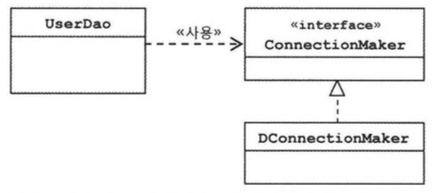
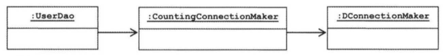

# 1장 - 오브젝트와 의존관계

## Intro

### 스프링의 핵심 철학

객체지향 프로그래밍이 제공하는 가치를 누리자. 기본으로 돌아가자. 오브젝트에 대한 관심.

### 오브젝트에 대한 관심이란?

* 오브젝트의 라이프 사이클
  * 오브젝트의 생성, 소멸
  * 타 오브젝트와 관계맺기와 사용
* 오브젝트의 설계
  * OOD(Object oriented design) 원칙, 기초
  * 디자인 패턴 - 다양한 목적에 부합되게 재활용 가능한 설계
  * 리팩토링 - 지속적인 구조 개선
  * 단위 테스트 - 오브젝트의 동작이 기대한 대로 되는지 검증

### 결국 스프링이 제공하는 것

* 오브젝트를 어떻게 설계, 구현, 사용, 개선에 대한 명쾌한 기준 제시
* 검증된 베스트 프렉티스 제공
  * 객체지향 기술
  * 설계, 구현에 관한 실용적 전략

## 1.1. 초난감 DAO

> == DAO(Data Access Object) ==
>
> DAO는 DB를 사용해 데이터를 조회하거나 조작하는 역할을 하는 오브젝트이다.

가장 기본적인 JDBC 코드 부터 시작한다. 지금 코드는 그냥 인터넷에 뿌려진 여느 예제와 같고, 실제 서비스에 적용하기에는 문제가 많다.

앞으로 이 예제가 위의 오브젝트에 대한 관심과 스프링의 기능의 도움을 받아 강력한 어플리케이션으로 탈바꿈하는지 꼼꼼히 살펴보자.

## 1.2. DAO의 분리

* 우리가 늘 염두에 두어야 하는것 1법칙
  * **소프트웨어는 끊임없이 변한다**
* 교훈은? **현명한 개발자는 미래의 변화에 대비한다.**
* 객체지향 기술은 변화에 효과적으로 대처가능함
* 어떻게 변화에 대응할 것인가?
  * 변화의 폭을 최소화한다. -> **분리와 확장**을 고려한 설계가 필요
* **분리와 확장**
  * 모든 변경과 발전은 한 번에 한 가지 관심사항에 집중해 일어난다.
    * 이런일은 없다 - "DB를 오라클에서 MySql로 바꾸면서, 웹 화면의 레이아웃을 다중 프레임 구조에서 단일 프레임에 Ajax를 적용한 구조로 바꾸고...."
    * 주로 이렇다 - "DB 접속암호가 A에서 B로 변경됩니다. 바꾸세요."
  * 우리의 문제 변화는 1건인데, 우리가 작업할 것은 n~무한대
  * 그래서..
    * 한 가지 관심이 한 곳에 집중되게 해야 함. 
    * 즉, 최대한 한 작업이 일어나면 한 곳만 변경하게 미리 준비
    * 공식용어 - **Separation of Concerns** (관심사의 분리)
      * 관심이 같은 것끼리 하나의 객체 안으로 혹은 친한 객체끼리 묶기
      * 관심이 다른 것은 따로 떨어뜨리기

결론 - 관심사 기준으로 객체의 나누기와 합치기를 잘 해보자!

### 1.2.2 커넥션 만들기의 추출

* 중복코드를 단일 class 안에서 하나의 메소드로 추출한다.

### 1.2.3. DB 커넥션 만들기의 독립

* 여러 확장 방법이 존재
* **상속을 통한 확장**
  * 'DB 커넥션 연결' 이라는 관심을 분리
  * 어떻게? 상속을 이용 서브클래스에 관심사를 둠
  * 관심사가 이렇게 나뉘었다.
    * UserDao - 어떻게 데이터를 가져올 것인가?(SQL작성, 파라미터 바인딩, 쿼리 실행, 검색정보 전달)
    * NUserDao/DUserDao - DB 연결은 어떻게 할 것인가?
  * Template Method Pattern(템플릿 메소드 패턴)
    * 슈퍼 클래스
      * 로직의 기본흐름
      * 기능 일부를 추상 메소드나 오버라이딩 가능 메소드를 제공
    * 서브 클래스
            * 위의 추상 메소드나 오버라이딩 가능 메소드를 필요에 맞게 구현해서 사용
  * Factory Method Pattern(펙토리 메소드 패턴)
    * getConnection()
    * 슈퍼 클래스 - Connection 타입 오브젝트가 만들어질 것을 메소드 정의만 함
    * 서브 클래스 - 구체적인 오브젝트 생성 방법을 결정
  * 단점
    * 상속 자체가 가지고 있는 문제
      * 이미 NUserDao 가 다른것을 상속중이라면 대책이 없음(Java는 오직 단일 상속)
      * fragile base class(깨지기 쉬운 기반 클래스 문제) - 자세한 내용은 검색!
        * UserDao 의 변화가 클수록, NUserDao 가 의도치 않은 사이드 이펙트가 날수 있음

> 디자인 패턴에서 가장 중요한 것은?
> - __**__목적과 의도__**__
> - 적용할 상황
> - 해결해야 할 문제
> - 솔루션의 구조와 각 요소의 역할

## 1.3. DAO의 확장

### 1.3.1. 클래스의 분리

* 좀 더 다른 방식으로 분리해보자!
  * 서로 독립적인 class 로 존재하게
  * composition(합성) 방식

* 하지만 합성으로 특성 클래스에 종속된다면?
  * SimpleConnectionMaker 의 makeNewConnection() 을 이름 변경만 있어도 UserDao가 변경이 일어남.
  * 다른종류의 SimpleConnectionMaker 와 바꾸려면? UserDao도 변경이 일어남(아래 요부분)
  ```java
  public UserDao() {
      this.simpleConnectionMaker = new SimpleConnectionMaker();
  }
  ```

### 1.3.2. 인터페이스의 도입

* 추상화란?
  * 어떤 것들의 공통적인 성격을 뽑아내어 이를 따로 분리해내는 작업
  * 그 추상화를 위한 도구 - 인터페이스

* 인터페이스
  * 어떤 일을 하겠다는 기능만 정의
  * 어떻게 하겠다는 자신을 구현한 클래스에 맞겨둠
  * 자신을 구현한 클래스에 대한 구체적 정보를 모두 감춤
  * 인터페이스를 사용하는 코드 쪽에서는 인터페이스로 추상화한 통로(기능)만 이해하면 됨
  * 위의 특성이 모여서 -> 구현 클래스간 느슨한 연결고리 역할

* 그러나 아직도 UserDao에 '어떤 ConnectionMaker 구현 클래스를 사용할지 결정'하는 코드가 남아있어 완전히 분리가 안된 상황

```java
public UserDao() {
    this.connectionMaker = new NConnectionMaker();
}
```

### 1.3.3. 관계설정 책임의 분리

* 위의 '어떤 ConnectionMaker 구현 클래스를 사용할지 결정' 코드 문제를 해결할 기막힌 방법이 없을까?
  * 사실 '어떤 ConnectionMaker 구현 클래스를 사용할지 결정'도 하나의 관심사다.
  * 이 관심사는 어디다 두어야 하나?
  * 아래에 해답이 있다

* 용어
  * 2개의 오브젝트가 있는데 A 오브젝트가 B 오브젝트의 기능을 사용한다 가정
  * B 오브젝트가 A 오브젝트에게 서비스를 제공하는 셈
  * B 오브젝트 - 서비스 오브젝트
  * A 오브젝트 - 클라이언트 오브젝트

* UserDao 와 ConnectionMaker 구현 클래스의 관계를 결정해주는 코드를 놓기에 적절한 곳은?
  * 정답은 UserDao의 클라이언트 오브젝트! 즉 제 3의 오브젝트(외부에서 만들게)
  * 예제에서는 UserDaoTest 라는 Test 코드에서 하도록 함.(즉 UserDaoTest가 클라이언트 오브젝트)

### 1.3.4. 원칙과 패턴

* 객체지향 설계 원칙 - 일반적인 객체지향에서 적용 가능한 설계 기준
* Open-Closed Principle(OCP, 개방 폐쇄 법칙)
  * 클래스나 모듈은
    * 확장에는 열려 있어야 하고
    * 변경에는 닫혀 있어야 한다

  * Case : UserDao
    * DB 연결 기능을 확장하는데 열려있다.
    * UserDao 자신의 핵심 기능을 구현한 코드는 DB 연결기능의 변화에 영향없이 유지할수 있다.
    * 인터페이스
      * 인터페이스를 통해 제공되는 확장 포인트는 확장을 위해 활짝 개방됨
      * 인터페이스를 이용하는 클래스는 자신의 변화가 불필요하게 이렁나지 않도록 굳게 폐쇄됨

* High coherence and low coupling(높은 응집도와 낮은 결합도)
  * 높은 응집도
    * 하나의 모듈, 클래스가 하나의 책임 또는 관심사에만 집중됨. 
    * 결과적으로 변화가 일어날 때 해당 모듈에서 변하는 부분이 크다.
  * 낮은 결합도
    * 결합도 - 하나의 오브젝트가 변경이 일어날 때 관계를 맺고 있는 다른 오브젝트에게 변화를 요구하는 정도
    * 책임과 관심사가 다른 오브젝트 또는 모듈과는 느슨하게 연결된 형태를 유지하는 것이 좋다
    * 느슨한 연결 - 관계를 유지하는데 꼭 필요한 최소한의 방법만 간접적 형태로 제공, 나머지는 서로 독립적이고 알 필요 없게 만든다.

  * Case : UserDao
    * UserDao 는 ConnectionMaker 의 관계는 인터페이스를 통해 매우 느슨하게 연결되어 있음.
    * UserDao 입장에서는 구체적인 ConnectionMaker 구현 클래스의 구현 방법이나 전략, 뒤에서 사용하는 오브젝트에 대해서 알 필요 없음

* Strategy Pattern(전략 패턴)
  * 자신의 기능 Context(맥락)에서 필요에 따라 
    * 변경이 필요한 알고리즘을 인터페이스를 통해 통째로 외부로 분리
    * 구체적인 알고리즘을 인터페이스 구현을 해서 필요에 따라 바꿔서 사용할 수 있게 하는
    * 디자인 패턴
* 스프링의 역할 - 위의 객체지향적인 설계 원칙과 디자인 패턴에 나타난 장점을 자연스럽게 개발자들이 활용할 수 있게 해주는 프레임워크

## 1.4. 제어의 역전(Inversion of Control)

### 1.4.1. 오브젝트 팩토리

* UserDaoTest
  * 실은 2가지 책임을 떠맡고 있다.
    * 기능이 잘 동작하는지 Test
    * UserDao 와 ConnectionMaker 생성 및 관계 설정
  * 위의 2가지 역할을 분리해보자!

* 팩토리 - 객체의 생성 방법을 결정하고 그렇게 만들어진 오브젝트를 돌려주는 역할
  * UserDaoTest -> DaoFactory / UserDaoTest (분리 작업)

* 설계도로서의 팩토리
  * 실질적인 로직역할 - UserDao, ConnectionMaker
  * 에플리케이션을 구성하는 컴포넌트의 구조와 관계를 정의한 설계도 - DaoFactory
    그림

### 1.4.2. 오브젝트 팩토리의 활용

* Dao 가 여러개로 늘어나면 DaoFactory는?
    ```java
    package springbook.user.dao;

    public class DaoFactory {
        public UserDao userDao() {
            return new UserDao(new DConnectionMaker());
        }
        public AccountDao userDao() {
            return new AccountDao(new DConnectionMaker());
        }
        public MessageDao userDao() {
            return new MessageDao(new DConnectionMaker());
        }
    }
    ```
* new DConnectionMaker() 코드의 중복 현상 발생
* 해결책은?
    ```java
    package springbook.user.dao;

    public class DaoFactory {
        public UserDao userDao() {
            return new UserDao(connectionMaker());
        }
        public AccountDao userDao() {
            return new AccountDao(connectionMaker());
        }
        public MessageDao userDao() {
            return new MessageDao(connectionMaker());
        }
        public ConnectionMaker connectionMaker() {
            return new DConnectionMaker();
        }
    }
    ```

### 1.4.3. 제어권의 이전을 통한 제어관계 역전

* 제어의 역전이란?
  * 간단하게 프로그램의 제어 흐름 구조를 뒤바꾸는 것
  * 일반적인 흐름 - main() 메소드에 프로그램 시작접, 오브젝트 생성, 관계 설정, 호출. 절차적인 프로그래밍
  * 제어의 역전은? 흐름을 거꾸로 뒤집음.
    * 오브젝트 자신이 사용할 오브젝트를 ***스스로 선택, 생성*** 하지 않음
    * 자신도 어떻게 만들어지고 어디서 사용되는지 알 수 없음.
    * 모든 제어권한을 자신이 아닌 다른 대상에 위임
    * 모든 오브젝트가 위임받은 제어 권한을 갖는 특별한 오브젝트에 의해 결정되고 만들어짐
  * 제어의 역전이 적용된 예
    * 서블릿
      * 제어의 권한은 서블릿 컨테이너가 가짐
      * 사용되는 대로 서블릿의 코드가 실행됨
    * 템플릿 메소드 패턴
      * 추상 UserDao를 상속한 서브클래스는 getConnection 이 언제 사용될지 자신은 모름
      * 상위 UserDao 가 제어의 권한을 가짐
    * 프레임워크
      * 라이브러리 - 에플리케이션 코드가 직접 흐름을 제어하는 중에 필요한 기능이 있을때 능동적으로 라이브러리를 호출함
      * 프레임워크 - 거꾸로 에플리케이션 코드가 프레임워크에 의해 사용됨
  * UserDao 예제에는?
    * 처음에는 ConnectionMaker의 구현클래스를 결정하고 만드는 제어권은 UserDao에게 있었음
    * 현재는 DaoFactory 에 옮겨짐
    * 제어 권한을 DaoFactory 에 넘겼으니 UserDao는 제어에 수동적인 존재가 됨
    * UserDaoTest도 DaoFactory가 공급해주는 오브젝트를 받아야 함으로 수동적인 존재가 됨
    * 이것이 제어의 역전이 일어난 상황
  * 결국 스프링은? IoC의 끝판왕(모든 오브젝트의 생성, 관계설정, 선택, 소멸 등 제어를 관장하는 프레임워크)

## 1.5. 스프링의 IoC

* 이제야 스프링을 적용해 본다.
* DaoFactory 역할을 스프링에서는 BeanFactory 또는 ApplicationContext 라고 부른다.
* DaoFactory 기능을 좀더 일반화/추상화 시켜놓은 것이다.

### 1.5.1. 오브젝트 팩토리를 이용한 스프링 IoC

* 주로 설명이나 용어정리가 뒤에서 잘 정리되어 있으므로 생략함

### 1.5.2. 애플리케이션 컨텍스트의 동작방식

* 오브젝트 팩토리(DaoFactory 같은)에 대응되는 것이 스프링의 ApplicationContext 
  * IoC 컨테이너 혹은 Bean Factory 라 불림
* 오브젝트 팩토리 직접 사용 대비 ApplicationContext 의 장점
  * 클라이언트가 구체적인 팩토리 클래스를 알 필요가 없음
    * 애플리케이션이 발전할수록 오브젝트 팩토리 갯수도 증가, 
      * 결국 어떤 오브젝트가 필요할 때 어떤 팩토리를 써야할지 알야아한다.
      * 팩토리를 다시 생성하는 것도 필요.
    * ApplicationContext는 아무리 애플리케이션이 커져도 일관되게 오브젝트를 가져옴
    * 상대적으로 자바코드로 모든 것을 다 제어하는 방식에 비해 단순한 설정으로 IoC 설정을 가능케 함.
  * ApplicationContext 는 종합 IoC 서비스 제공
    * 단순히 오브젝트 생성, 다른 오브젝트와 관계설정 만 해주는 것이 아님
    * 오브젝트가 만들어지는 전략을 다르게 가져가기, 자동생성, 생성후 후처리, 정보의 조합, 설정 방식의 다변화, 인터셉팅 등등
    * 고급 기능이 필요해질 시접이 반드시 옴
  * ApplicationContext는 bean을 검색하는 다양한 방식 제공

### 1.5.3. 스프링 IoC의 용어 정리

* Bean(빈)
  * 스프링이 IoC 방식으로 관리하는 오브젝트(managed object)
  * 스프링이 직접 그 생성과 제어를 담당하는 오브젝트

* Bean Factory(빈 팩토리)
  * 스프링의 IoC 를 담당하는 핵심 컨테이너
  * 빈을 등록, 생성, 조회, 그 외 부가적인 빈을 관리하는 기능
  * <BeanFactory> - 빈 팩토리를 구현하고 있는 가장 기본적인 인터페이스를 지칭

* ApplicationContext(애플리케이션 컨택스트)
  * 빈 팩토리를 확장한 IoC 컨테이너
  * 스프링이 제공하는 각종 부가 서비스가 추가됨
  * <ApplicationContext> - 애플리케이션 컨텍스트가 구현해야 하는 기본 인터페이스를 지칭

* Configuration metadata(설정정보/설정 메타정보)
  * 애플리케이션 컨텍스트 또는 빈 팩토리가 IoC를 적용하기 위해 사용하는 메타정보
  * 컨테이너의 어떤 기능을 설정 + IoC 컨테이너에 의해 관리되는 애플리케이션 오브젝트를 생성하고 구성할때 사용
  * blueprint(청사진)

* Container(컨테이너 또는 IoC 컨테이너)
  * IoC 방식으로 빈을 관리한다는 의미에서 컨테이너 또는 IoC 컨테이너라고 함
  * 컨테이너 - 애플리케이션 컨텍스트보다 추상적인 표현

## 1.6. 싱글톤 레지스트리와 오브젝트 스코프

> == 오브젝트의 동일성(identity) vs 동등성(equality) ==
>
> * 자바에서는?
>   * == 연산자 - 동일성
>   * equals() 메소드 - 동등성
>     * equals를 재정의 해서 동등성을 비교하게 함
>     * 재정의 하지 않으면 최상위 Object 의 equals 결과를 반환함. 이때는 동일한 오브젝트여야 동등한 오브젝트라고 간주함.
>
> * 동일성은 결국 하나의 오브젝트만 존재하나 두개의 오브젝트 레퍼런스 변수만 가지고 있는 상태
> * 동등성은 두 개의 각기 다른 오브젝트가 메모리상에 존재하지만 로직상의 정의에 따라 오브젝트의 정보가 >같다고 판단함.
>   * 예시 ) Person 클래스에 lastName, firstName 멤버변수가 존재할때 두 멤버가 같은 문자열일경우 같은 사람으로 판단하는 경우

### 1.6.1. 싱글톤 레지스트리로서의 애플리케이션 컨텍스트

* singleton registry
  * 애플리케이션 컨텍스트는 별 다른 설정이 없으면 내부에서 생성하는 빈 오브젝트를 모두 싱글톤으로 만든다.
  * 즉 한 컨테이너에 1개의 오브젝트만 만들어진다.

* 왜 스프링은 싱글톤으로 빈을 만드는 것일까?
  * 기본적으로 스프링은 자바 엔터프라이즈 기술 즉, 초당 수십에서 수백번 클라이언트 요청을 받아 처리하는 서버 환경에서 쓰는 기술이다.
  * 하나의 요청을 처리하기 위해 계층형 구조로 이루어져 있다(데이터 엑세스 로직, 서비스 로직, 비즈니스 로직, 프레젠테이션 로직 등)
  * 만약 매번 클라이언트에서 요청이 올 때마다 각 로직을 담당하는 오브젝트를 새로 만들어서 사용한다면?
    * 요청 한번에 5개(위의 5계층)의 오브젝트를 새로 만듦
    * 초당 500개 요청이라면 ? 5 * 500 = 2500, 초당 2500개의 오브젝트 생성
    * 1분 = 15만개, 1시간 = 900만개 오브젝트 생성... 
    * 아무리 JVM 의 오브젝트 생성 성능과 GC 성능이 높아졌어도...
  * 결론 - 성능 부하가 많음
  * 그래서
    * 보통은 서비스 오브젝트라는 개념이 예전부터 도입됨(즉 싱글톤으로 구성된 각 계층의 로직이 담긴 오브젝트)
    * 서블릿은 대부분 멀티스레드 환경에서 싱글톤으로 동작함
      * 서블릿 클래스당 하나의 오브젝트만 만들어두고
      * 사용자의 요청을 담당하는 여러 쓰레드에서 하나의 오브젝트를 공유해 사용
    * 애플리케이션안에서 제한된 오브젝트 수(대게 1개)만 만들어서 사용하는 것이 싱글톤 패턴의 원리

* 싱글톤 패턴의 한계 - 그래서 POJO로 싱글톤을 만들어서 도입하면 아래의 문제에 봉착하게 된다.
  * private 생성자를 갖고 있기 때문에 상속할 수 없다.
  * 싱글톤은 테스트하기 힘들다.
  * 서버환경에서는 싱글톤이 하나만 만들어지는 것을 보장하지 못한다.
  * 싱글톤의 사용은 전역 상태를 만들 수 있기 때문에 바람직하지 못하다.

* 다시 singleton registry
  * 꼭 필요한 패턴이나 위의 한계가 명확하다. 
  * 이 한계를 줄이기 위해 스프링은 직접 싱글톤 형태의 오브젝트를 만들고 관리한다. 그것이 싱글톤 레지스트리다.
    * private 생성자 불필요
    * 상속 가능
    * 평범한 자바 클래스로 싱글톤을 만듦으로 테스트 용이
    * 어플리케이션 컨텍스트 내에서 하나만 만들어지는 것이 보장됨
    * 싱글톤은 전역상태(global state)이므로 bean 에 상태값을 갖지 않도록 유의해서 개발이 필요(스프링 개발에서 매우 중요한 개념!)
  * 스프링에서는 특별한 설정이 없다면 getBean() 을 여러번 호출해도 매번 같은 오브젝트를 반환한다.

* 스프링은 IoC 컨테이너일 뿐만 아니라, 고전적인 싱글톤 패턴을 대신해 싱글톤을 만들고 관리해주는 싱글톤 레지스트리이다.

### 1.6.2. 싱글톤과 오브젝트의 상태

* 싱글톤이 멀티스레드 환경에서 서비스 형태의 오브젝트로 사용되는 경우 - stateless(무상태) 방식으로 만들어져야 함
  * 다중 사용자의 요청을 한꺼번에 처리하는 스레드들이 동시에 싱글톤 오브젝트의 인스턴스 변수를 수정(update)하는 것은 위험
  * 저장할 공간이 하나뿐이라서 서로 값을 덮어쓰고 자신이 저장하지 않은 값을 읽어올 수 있음
  * 초기화 이후 값이 변경되지 않는 읽기 전용의 값은 허용됨
  * 그럼 상태값은 어떻게 다루는가? 다음을 이용
    * 파라미터
    * 메소드 안 로컬변수
    * 리턴값
  * 위의 3가지는 매번 새로운 값을 저장할 독립적 공간이 마련됨 - 스레드 간 간섭이 없음

* 다시 UserDao 로 돌아와서...
  * ConnectionMaker는 인스턴스 변수로 사용하지만
    * @Bean 지정이 되어 있어서 스프링의 싱글톤 빈으로 만들어져서 주입된다.
    * 이것은 싱글톤이 되어도 상관없다. 이유는 읽기전용의 정보이기 때문이다.

### 1.6.3. 스프링 빈의 스코프

* 빈의 스코프(scope)
  * 스프링이 관리하는 빈(bean) 이 생성되고, 적용되는 범위
  * 기본 스코프 - 싱글톤(singleton)
  * 스코프의 종류
    * prototype - 빈을 컨테이너에 요청할 때마다 매번 새로운 오브젝트(bean) 생성
    * request - HTTP 요청이 생길 때마다 생성됨
    * session - 웹의 세션과 라이프 사이클이 거의 동일

## 1.7. 의존관계 주입(Dependency Injection)

### 1.7.1. 제어의 역전(IoC)과 의존관계 주입

> DI(Dependency Injection)란?
>
> 번역하면 의존관계 주입
>
> 오브젝트 레퍼런스를 외부로부터 제공(주입)받고 이를 통해 여타 오브젝트와 다이내믹하게 의존관계가 만들어지는 것

* 스프링이 제공하는 IoC 방식의 핵심 - 의존관계 주입
* 따라서 스프링을 DI 컨테이너라고 부르기도 한다

### 1.7.2. 런타임 의존관계 설정

* 의존관계란?
  * 
  * A 가 B에 의존한다 - 그림 1-10
  * 의존대상(여기서 B) 가 변하면 그것이 A에 영향을 미침
  * B 의 기능이 추가,변경, 형식이 바뀌면? => A 가 영향을 받음
  * 의존관계는 방향성이 있음 
    * A가 B에 의존하지만 B는 A에 의존하지 않음
    * B는 A의 변화에 영향받지 않음

* UserDao 예제
  * 
  * UserDao 가 ConnectionMaker 에 의존하고 있음
  * ConnectionMaker 인터페이스가 변한다면 그 영향을 UserDao 가 받음
  * 그러나 ConnectionMaker 인터페이스를 구현한 클래스를 다른 것(예-DConnectionMaker)으로 바꾸거나, 내부에 메소드에 변화가 생겨도 UserDao에 영향을 주지 않음
  * 인터페이스에 대해서만 의존관계 형성 - 서로의 관계를 느슨하게 함. 즉 변화에 영향을 덜 받게 함
  * 영향을 덜 받음 = 결합도가 낮음
  * 런타임 시에는 의존관계가 달라짐. 즉 실제 오브젝트를 생성하는 UserDao 오브젝트와 ConnectionMaker 인터페이스를 구현한 클래스의 오브젝트와 맺게 됨
  * 의존 오브젝트(Dependenet Object) - NConnectionMaker, DConnectionMaker
  * [중요!] 다시 **의존관계 주입이란?**
    * 구체적인 의존 오브젝트와 그것을 사용할 주체, 보통 클라이언트라고 부르는 오브젝트를 런타임 시에 연결해주는 작업을 말함
  * [중요!] 의존관계 주입의 **3가지 조건**
    * 클래스 모델이나 코드에는 런타임 시점의 의존관계가 드러나지 않는다. 그러기 위해서는 **인터페이스에만 의존**해야 한다.
    * 런타임 시점의 의존관계는 컨테이너나 팩토리 같은 **제3의 존재가 결정**(DaoFactory, ApplicationContext 등)한다.
    * 의존관계는 **사용할 오브젝트에 대한 레퍼런스를 외부에서 제공(주입)**해줌으로써 만들어진다.

### 1.7.3. 의존관계 검색과 주입

* dependency lookup
  * 외부로부터의 주입이 아니라 스스로 검색을 이용
  * 자신이 필요로 하는 의존 오브젝트를 능동적으로 찾음
  * 자신이 어떤 클래스의 오브젝트를 이용할지 결정하지 않음
  * 런타임 시 의존관계를 맺을 오브젝트를 결정하는 것과 오브젝트의 생성작업은 외부 컨테이너에게 IoC로 맞김
  * 의존관계를 가져오는 메소드나 생성자를 통한 주입 대신 스스로 컨테이너에 요청하는 방법

DaoFactory로 의존관계 오브젝트를 가져오는 코드

```java
    public UserDao() {
        DaoFactory daoFactory = new DaoFactory();
        this.connectionMaker = daoFactory.connectionMaker();
    }
```

스프링 ApplicationContext로 가져오는 코드

```java
    public UserDao() {
        AnnotationConfigAppcationContext context = new AnnotationConfigAppcationContext(DaoFactory.class);
        this.connectionMaker = context.getBean("connectionMaker", ConnectionMaker.class);
    }
```

* dependency injection(의존관계 주입) vs dependency lookup(의존관계 검색)
  * 의존관계 검색은 오브젝트 펙토리 클래스나 스프링 API가 기존 코드안에 사용됨
  * 고로 코드가 깔끔하지 못하고 클래스간 역할분리가 완벽하지 않다.
  * 의존관계 검색방식을 이용해야 하는경우
    * 등록된 빈을 직접 가져와야 하는경우 - 예) UserDaoTest
    * 가져오는 대상이 빈에 등록되지 않는 경우

### 1.7.4. 의존관계 주입의 응용

* 기능 구현의 교환
  * ConnectionMaker의 다양한 활용
    * 개발용 ConnectionMaker
    * QA용 ConnectionMaker
    * 운영용 ConnectionMaker
  * DI 설정 1가지만 바꾸면 간편하다.
* 부가 기능 추가
  * DAO 가 DB를 연결한 수를 카운트한다.
  * Decorator Pattern 을 적용
  * 아래 그림과 같이 Decorator역할의 CountingConnectionMaker 오브젝트를 DI 하면 끝!



### 1.7.5. 메소드를 이용한 의존관계 주입

* 지금까지는 의존관계 주입을 **생성자** 만 사용
* 3가지 의존관계 주입 방식이 존재함
  * 생성자
  * 수정자 메소드를 이용한 주입(setter)
  ```java
    public class UserDao {
        private ConnectionMaker connectionMaker;

        public void setConnectionMaker(ConnectionMaker connectionMaker) {
            this.connectionMaker = connectionMaker;
        }
    }
  ```
  * 일반 메소드를 이용한 주입
    * 수정자 메소드의 제약 - 한 번에 한 개의 파라메터만 가짐. setXXX로 시작되는 네이밍
    * 여러개의 파라메터로 의존관계 주입을 원한다면 이 방식을 사용
* 전통적으로 대부분 **수정자** 방식을 주로 선호한다

## 1.8. XML을 이용한 설정

* 오브젝트 사이의 의존관게 설정
  * DaoFactory와 같은 자바 코드 방식
  * XML 설정 방식
    * 단순한 텍스트라 다루기 쉬움
    * 자바 컴파일과 같은 빌드가 필요 없음
    * 빠르게 변경사항을 반영이 가능

### 1.8.1. XML 설정

* 하나의 bean 안의 DI 정보
  * 빈의 이름 : getBean() 에서 가져올 때 사용
  * 빈의 클래스 : 빈 오브젝트를 어떤 클래스를 이용해서 만들지 결정
  * 빈의 의존 오브젝트 : 빈의 생성자, 수정자 메소드를 통해 의존 오브젝트를 넣어줌. 의존 오브젝트도 하나의 빈이므로 이름이 이을 것이고, 그 이름에 해당하는 메소드를 호출하여 의존 오브젝트를 가져옴.
    * name 에트리뷰트 - DI에 사용할 수정자 메ㅔ소드의 프로퍼티 이름
    * ref 에트리뷰트 - 주입할 오브젝트를 정의한 빈의 ID

* 클래스 설정과 XML 설정의 대응항목

|        | 자바 코드 설정정보              | XML 설정정보                  |
| ------ | ----------------------- | ------------------------- |
| 빈 설정파일 | @Configuration          | <beans>                   |
| 빈의 이름  | @Bean methodName()      | <bean id=""methodName"    |
| 빈의 클래스 | return new BeanClass(); | clsss="a.b.c...BeanClass> |

* connectionMaker() 메소드의 <bean> 태그로 전환

### 1.8.2. XML 을 이용하는 ApplicationContext

* GenericXmlApplicationContext
  * 생성자에 applicationContext.xml 의 클래스패스를 넣음
  * 루트 기준 or 실행되는 class 기준의 클래스패스
  * 예1) / 가 붙을경우 코드가 실행되는 패키지를 기준으로 찾음. 같은 패키지의 applicationContext.xml 이 있으면 설정정보 로딩
  ```java
  ApplicationContext ac = new GenericXmlApplicationContext("/applicationContext.xml");
  ```
  * 예2) / 가 없을 경우 클래스패스의 루트에서 applicationContext.xml 찾음
  ```java
  ApplicationContext ac = new GenericXmlApplicationContext("applicationContext.xml");
  ```
* ClassPathXmlApplicationContext
  * 인자로 넘기는 class 오브젝트의 패키지기준으로 xml 파일 path 지정함.
  * 예3)
  ```java
  ApplicationContext ac = new ClassPathXmlApplicationContext("daoContext.xml", UserDao.class);
  ```

### 1.8.3. DataSource 인터페이스로 전환

* 사실 Spring 에는 ConnectionMaker 와 동일한 역할을 하는게 있다. 그것은 DataSource
* 우리가 원하는 DataSource 구현체들은 이미 다 구현되어 있고, 안정적이다.
* connectionMaker를 스프링의 DataSource로 바꿔서 사용해보자

### 1.8.4. 프로퍼티 값의 주입

* 다른 오브젝트의 레퍼런스만이 주입할 수 있는 것은 아니다.
* 오브젝트가 아닌 단순 값을 DI 한다. (String, Integer 등등)
* 예) Datasource에 DB connection 정보를 주입한다.
  * JavaConfig 방식
  ```java
    dataSource.setDriverClass(com.mysql.jdbc.Driver.class);
    dataSource.setUrl("jdbc:mysql://localhost/springbook");
    dataSource.setUsername("spring");
    dataSource.setPassword("book");
  ```
  * XML 방식
  ```xml
    <property name="driverClass" value="com.mysql.jdbc.Driver"/>
    <property name="url" value="jdbc:mysql://localhost/springbook"/>
    <property name="username" value="spring"/>
    <property name="password" value="book"/>
  ```

## 1.9. 정리

* 먼저 책임이 다른 코드를 분리하여 두 개의 클래스로 만듦(관심사의 분리, 리팩토링)
* 그 중에서 바뀔 수 있는 쪽의 클래스는 인터페이스를 구현하도록 하고, 다른 클래스에서 인터페이스를 통해서만 접근하도록 만들었다. 이렇게 해서 인터페이스를 정의한 쪽의 구현 방법이 달라져 클래스가 바뀌더라도, 그 기능을 사용하는 클래스의 코드는 같이 수정할 필요가 없도록 만들었다(전략 패턴)
* 이를 통해 자신의 책임 자체가 변경되는 경우 외에는 불필요한 변화가 발생하지 않도록 막아주고, 자신이 사용하는 외부 오브젝트의 기능은 자유롭게 확장하거나 변경할 수 있게 만들었다(개방 패쇄 원칙)
* 결국 한쪽의 기능 변화가 다른 쪽의 변경을 요구하지 않아도 되게 했고(낮은 결합도), 자신의 책임과 관심사에만 순수하게 집중하는(높은 응집도) 깔끔한 코드를 만들 수 있었다.
* 오브젝트가 생성되고 여타 오브젝트와 관계를 맺는 작업의 제어권을 별도의 오브젝트 팩토리를 만들어 넘겼다. 또는 오브젝트 팩토리의 기능을 일반화한 IoC 컨테이너로 넘겨서 오브젝트가 자신이 사용할 대상의 생성이나 선택에 관한 책임으로부터 자유롭게 만들어줬다(제어의 역전/IoC)
* 전통적인 싱글톤 패턴 구현 방식의 단점을 살펴보고, 서버에서 사용되는 서비스 오브젝트로서의 장점을 살릴 수 있는 싱글톤을 사용하면서도 싱글턴 패턴의 단점을 극복할 수 있도록 설계된 컨테이너를 활용하는 방법에 대해 알아봤다(싱글톤 레지스트리).
* 설계 시점과 코드에는 클래스와 인터페이스 사이의 느슨한 의존관계만 만들어놓고, 런타임시에 실제 사용할 구체적인 의존 오브젝트를 제3자(DI 컨테이너)의 도움으로 주입받아서 다이내믹한 의존관계를 갖게 해주는 IoC의 특별한 케이스를 알아봤다(의존관계 주입/DI)
* 의존 오브젝트를 주입할 때 생성자를 이용하는 방법과 수정자 메소드를 이용하는 방법을 알아봤다(생성자 주입과 수정자 주입).
* 마지막으로, XML을 이용해 DI 설정정보를 만드는 방법과 의존 오브젝트가 아닌 일반 값을 외부에서 설정해서 런타임 시에 주입하는 방법을 알아봤다(XML 설정).

* 다시한번 스프링이란? 어떻게 오브젝트가 설계되고, 만들어지고, 어떻게 관계를 맺고 사용되는지에 관심을 갖는 프레임워크
* 스프링의 관심 - 오브젝트와 그 관계
* 그러나 오브젝트를 어떻게 설계하고 분리하고 개선하고 어떤 의존관계를 가질지 결정하는건 개발자의 몫