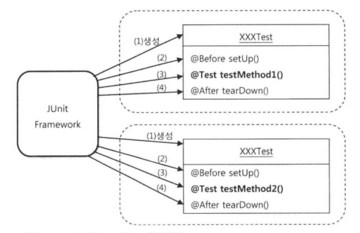

# 2장 - 테스트

## Intro

### 두 번째 중요한 전략

* 에플리케이션은 계속 변하고 복잡해진다. 그 변화에 대응하기 위한 전략 2가지가 있다.
  * 첫째, 객체지향적 설계와 그것을 효과적으로 담을 IoC/DI 기술
  * 두번째, 만들어진 코드를 확신할 수 있게 해주고, 변화에 유연하게 대처할 수 있게 해주는 자신감을 주는 테스트
    * 또한 테스트는 스프링을 학습하는 데 있어 가장 효과적인 방법의 하나
    * 테스트의 작성은 스프링의 다양한 기술을 활용하는 방법을 이해하고 검증하고 실전에 적용하는 방법을 익히는 데 효과적임

### 2장의 내용

* 테스트란 무엇인가?
* 그 가치와 장점
* 활용전략
* 스프링과의 관계
* 테스트 프레임워크 소개
* 테스트 프레임워크를 이용한 학습전략

## 2.1. UserDaoTest 다시보기

* 웹을 통한 DAO 테스트 방법의 문제점
  * 보통 웹 에플리케이션 테스트 방식
    * DAO, Service, MVC 프레젠테이션 계층까지 대충 쭉 만듦
    * 서버에 배치
    * 웹 화면을 띄워 폼을 열고, 값을 입력한 뒤 버튼을 눌러 등록해봄
    * 에러가 없는지 확인
  * 이런 방식은... **모든것을 만들고 나서야 테스트가 가능하다는 점** 이 가장 큰 문제
  * 어디에서 문제가 발생했는지 찾기 힘듦. 테스트에 모든 계층이 참여하고 있기 때문
  * 그렇다면?

* 작은 단위의 테스트
  * 테스트 하고자 하는 대상에만 집중하여 테스트 하는 것이 바람직
    * 엉뚱하게 UserDao 기능을 돌려보려고 만든 JSP나 서블릿에 에러가 발생해서 그것을 찾으려고 시간낭비할 필요가 없음
  * unit test(단위 테스트) - 작은 단위의 코드에 대해 테스트를 수행한 것. 하나의 관심사에 집중
  * 지금까지 본 UserDaoTest도 일종의 단위 테스트라고 볼 수 있다.
    * UserDao라는 작은 단위의 기능만을 담당하기 때문
  * 물론 전 과정이 하나로 묶인 통합 테스트도 필요하다
    * 그렇지만 단위 테스트가 없이 통합 테스트에서 오류가 난다면 문제의 원인을 찾기 매우 힘들다.
    * 이미 각 단위별로 충분한 검증을 하고 있다면 오류를 찾는 범위가 훨씬 줄어든다.
  * 또한 개발자 본인이 자신의 로직을 빠르게 검증하는데도 단위 테스트가 필요하다.

* 자동 수행 테스트
  * 필요한 이유
    * 개발자의 특별한 개입없이 자동으로 수행되는 것이 효율적이다. 테스트 속도 - 컴퓨터 vs 인간
    * 사람은 반복행동을 4~5회만 해도 지친다.
    * 사람이 수동으로 테스트 결과를 판단하는 것은 실수할 가능성이 높다.
    * 자주 반복 가능 - 번거롭지 않고, 빠르게 실행가능하기 때문

* 지속적인 개선과 점짐적인 개발을 위한 테스트
  * 이미 검증 가능한 테스트가 있기 때문에 조금씩 코드를 개선해 나가는 것이 쉽다.
  * 변경후 테스트로 간단히 확인해보면 되기 때문
  * [개선 -> 테스트 -> 개선 -> 테스트 ...] 안정적이면서 빠르게 진행이 가능하다.

### 2.1.3 UserDaoTest의 문제점

* 수동 확인 작업의 번거로움
  * 테스트 수행작업과 입력 데이터 준비는 자동으로 되어 있음
  * 그러나 결과는 여전히 console 창의 결과를 사람의 눈으로 판단함
  * 이것 또한 검증할 양이 많아지면 사람의 눈으로 일일히 확인 불가능함
* 실행 작업의 번거로움
  * 즉각 실행가능한 main() 에 있지만 이런 Test용 클래스가 한 에플리케이션에 수백개라면?
  * 수백번 직접 실행해야함
  * 좀 더 체계적으로 간편하게 실행되는 것이 필요

## 2.2. UserDaoTest 의 개선

### 2.2.1. 테스트 검증의 자동화

* 모든 테스트의 결과는 3가지
  * 성공
  * 실패
    * 에러 발생
    * 결과가 기대한 것과 다름

* 에러발생은 비교적 명확히 알기 쉬움
  * jvm에서 호출스텍과 에러메시지가 상세히 출력됨
* 그러나 결과가 다른 것은 어떻게?
  * 기대한 결과가 나오는지 안나오는지 판정까지 필요함

### 2.2.2. 테스트의 효율적인 수행과 결과 관리

* JUnit - 이미 JAVA는 위에서 언급한 요구사항을 만족하는 단위 테스트를 위한 프레임워크가 존재
  * 일정한 패턴을 가진 테스트를 만들 수 있음
  * 많은 테스트를 간단히 실행 가능
  * 테스트 결과를 종합해서 볼수 있음
  * 테스트가 실패한 곳을 빠르게 찾을 수 있음

* JUnit으로 테스트 전환
  * 전환된 소스 참고
  * 기존 main() -> 테스트 메소드 전환(2가지 조건)
    * @Test 추가
    * public 선언
  * 검증 코드 전환
    * JUnit 이 제공하는 AssertThat 스테틱 메소드 이용
  * 실행 - 최근에는 IDE 에서 바로 실행 가능하게 지원함
  * 결과 출력 - IDE 에서 OK / Failures 로 통계 및 실패 위치 이동하도록 함

## 2.3. 개발자를 위한 테스팅 프레임워크 JUnit

* 스프링 프레임워크 자체도 JUnit 프레임워크로 테스트하면서 만들어짐
* 별도의 **스프링 테스트 모듈** 이 있으며 기반은 JUnit이다.

### 2.3.1. 테스트 실행 방법

TOOL 에 관한 설명으로 생략

### 2.3.2. 테스트 결과의 일관성

* 현재 UserDaoTest의 가장 불편한점
  * 한번 실행하면 2번째는 기본키 중복으로 에러발생
  * User Table을 한번 삭제해줘야 함
* 테스트가 외부 상태에 따라 결과가 달라지는 문제 -> 별도의 작업이 필요함. 번거로움.
* 결론 - 코드에 변경사항이 없다면 늘 테스트는 동일한 결과를 내어야 한다(테스트 결과의 일관성)

* 개선시작! - 결국 삭제 코드를 추가함으로 이 문제를 해결해 보자
  * deleteAll() - users 테이블 데이터 전체 삭제
  * getCount() - users 테이블의 전체 row수

* deleteAll() 와 getCount() 의 테스트
  * 현재 1개씩 따로 검증하는것은 어려우므로 기존 addAndGet() 테스트에 필요한 곳에 추가하여 원하는 대로 동작하는지 검증
  * addAndGet 시작시 처음 deleteAll() 하여 기존 user 삭제후 getCount()가 0 인지 확인
  * UserDao.add() 후 getCount()로 1 로 늘었는지 확인

* **결론! - 단위 테스트는 항상 일관성 있는 결과가 보장되어야 한다**

### 2.3.3. 포괄적인 테스트

* 아직 새로 추가된 기능이 검증이 완전하지 않으므로 각각의 검증 Test 를 작성한다.
* getCount() 테스트 추가
* addAndGet() 테스트 보완
* get() 예외 조건에 대한 테스트
  * 만약 해당되는 user 의 id 가 없다면?
    * null 과 같은 특정한 값 반환
    * 해당 id 를 찾을 수 없다고 예외를 던짐**(이 방법을 선택)**
      * 스프링이 쓰는 EmptyResultDataAccessExcepption 예외를 이용
  * 검증을 위한 test 코드부터 먼저 만들어 보자!
    * 기존 AssertThat으로는 테스트 성공을 판단할 수 없다.
    * JUnit은 특정 예외가 발생하면 테스트 성공으로 판단하는 설정이 있다.
    * 이제 우리는 EmptyResultDataAccessExcepption 발생하면 성공하는 TestCase를 작성한다.
      ```java
        @Test(expected = EmptyResultDataAccessException.class)
      ```
  * get() 에 user 를 찾을 수 없으면 EmptyResultDataAccessException 을 발생시키는 로직 구현
  * 완성되면 기존 3개의 Test를 모두 돌려본다.
  * 모두 성공하면 새로 추가한 기능도 정상동작하고 기존 기능에도 영향을 주지 않음을 개발자는 확신할 수 있다.
* 다시 DAO의 포괄적인 테스트
  * 이렇게 포괄적인 테스트를 만들어 두는 것이 개발시 훨씬 안전하고 유용하다.
  * But 개발자는 성공하는 테스트만 골라서 만드는 실수를 많이 한다.
  * 거의 모든 상황과 입력값을 고려하여 Test 가 필요하다.
  * 예외적인 상황을 빠뜨리지 않는 꼼꼼함이 필요하다.

### 2.3.4. 테스트가 이끄는 개발

* get() 메소드의 예외 테스트 만드는 과정
  * 보통의 순서 :  기능코드수정 -> 테스트 코드
  * 2.3.3.에서 : 테스트 코드 -> 기능 코드 수정
    * 실패한 테스트가 성공한 테스트로 변하기 까지 개발을 진행하는 방식
* 기능설계를 위한 테스트
  * 테스트 할 코드가 없지만, 추가하고 싶은 기능을 코드로 표현하려고 했기 때문에 getUserFailure()를 작성할수 있었음

|     | 단계         | 내용                       | 코드  |
| --- | ---------- | ------------------------ |---|
| 조건  | 어떤 조건을 가지고 | 가져오는 사용자 정보가 존재하지 않는 경우에 | dao.deleteAll(); assertThat(dao.getCount(),is(0)); |
| 행위  | 무엇을 할때     | 존재하지 않는 id로 get() 을 실행하면 |  get("unknown_id")   |
| 결과  | 어떤 결과가 나온다 | 특별한 예외가 던져진다.            |  @Test(expected = EmptyResultDataAccessException.class)   |

* **비교해보면 이 테스트 코드는 잘 정의된 하나의 기능정의서로 보임**
* 테스트 코드가 기능설계의 일부를 담당하고 있음 (기능설계-구현-테스트 개발흐름 중)
* Test Driven Development(TDD)
  * 테스트가 주는 장점을 극대화한 방법
  * 아에 테스트를 먼저 만들고 그 테스트가 성공하도록 하는 코드만 만드는 식
  * 테스트 작성 시간과 에플리케이션 코드를 작성하는 시간 간격이 짧아야 한다
  * 기본 원칙 - 실패한 테스트를 성공시키기 위한 목적이 아닌 코드는 만들지 않는다.

### 2.3.5. 테스트 코드 개선

* 테스트 코드도 리펙토링의 대상이 된다
* UserDaoTest에서 반복되는 부분이 있다.

```java
  ApplicationContext ac = new GenericXmlApplicationContext("applicationContext.xml");
  UserDao dao = ac.getBean("userDao", UserDao.class);
```

* 중복된 코드는 별도의 메소드로 뽑아내자
* **@Before**
  * JUnit이 하나의 테스트를 가져와 테스트를 수행하는 방식
    1. 테스트 클래스에서 @Test가 붙은 public이고 void형이며 파라미터가 없는 테스트 메소드를 모두 찾는다
    1. 테스트 클래스의 오브젝트를 하나 만든다.
    1. @Before가 붙은 메소드가 있으면 실행한다
    1. @Test가 붙은 메소드를 하나 호출하고 테스트 결과를 저장해둔다.
    1. @After가 붙은 메소드가 있으면 실행한다.
    1. 나머지 테스트 메소드에 대해 2~5번을 반복한다.
    1. 모든 테스트의 결과를 종합해서 돌려준다.
  * 즉 @Before는 모든 @Test가 붙은 메소드 실행 전에 자동으로 실행한다.
  * 기억해야 할 사항 - 각 테스트 메소드를 실행할 때마다 테스트 클래스의 오브젝트를 새로 만든다
    * @Test가 2개 있다면 테스트 실행중 이 클래스의 오브젝트를 2번 만들고 버린다.

  

    * 왜 실행할 때마다 새로 만드는 것인가?
      * 각 테스트가 서로 영향을 주지 않고 독립적으로 실행됨을 확실히 보장해주기 위해 매번 새로운 오브젝트를 만든다.
* Fixture(픽스쳐)
  * 테스트를 수행하는데 필요한 정보나 오브젝트
  * 일반적으로 반복적으로 사용하기 때문에 @Before에 생성해 두면 편리함
  * User 오브젝트 들도 픽스쳐에 해당함

## 2.4. 스프링 테스트 적용

* 문제발생! 테스트 메소드 실행시마다 스프링의 어플리케이션 컨텍스트도 매번 생성한다.
  * 지금이야 규모가 작지만 빈이 많아지고 의존관계가 복잡해진다면 생성에 적지않은 시간이 걸린다
  * 어플리케이션 컨텍스트가 초기화 할때 어떤 빈은 독자적으로 많은 리소스를 할당하거나 독립적인 스레드를 띄운다. 
    * 즉 빈이 할당한 리소스를 깔끔하게 정리해주지 않으면 다음 테스트에서 문제가 발생할 여지가 크다.
  * 결론 - 일반적으로 어플리케이션 컨텍스트는 생성에 시간과 자원이 많이 소모된다

* 또한 어플리케이션 컨텍스트 안의 빈은 대부분 싱글톤이다. 빈의 상태가 없다.
* 또 다시 결론 - 에플리케이션 컨텍스트는 한 번만 만들고 여러 테ㅔ스트가 공유해서 사용해도 된다.
* JUnit은 매번 테스트마다 클래스 오브젝트를 새로 만든다. 그렇다면 어떻게 한 번만 에플리케이션 컨텍스트를 만들 것인가?

### 2.4.1. 테스트를 위한 어플리케이션 컨텍스트 관리

* 스프링은 JUnit을 이용하는 테스트 컨텍스트 프레임워크를 제공함
* 스프링 테스트 컨텍스트 프레임워크 적용

```java
  @RunWith(SpringJUnit4ClassRunner.class)
  @ContextConfiguration(locations = "/applicationContext.xml")
  public class UserDaoTest {
      @Autowired
      private ApplicationContext context;
```

  * @RunWith 는 JUnit 프레임워크의 테스트 실행방법을 확장할 때 사용하는 애노테이션
  * SpringJUnit4ClassRunner class가 테스트가 사용할 에플리케이션 컨텍스트를 만들고 관리하는 작업을 진행함
  * @ContextConfiguration 에플리케이션 컨텍스트의 설정파일 위치를 지정
  * 다음과 같이 setUp() 에 추가하면 실제로 어플리케이션 컨텍스트가 1회공용이 되는지 확인할수 있다.

```java
  System.out.println(this.context);
  System.out.println(this);
```

  * 테스트 수행속도의 향상 - 처음 Test가 어플리케이션 컨텍스트 생성하느라 시간이 걸리는거 제외하고 나머지 테스트는 시간이 적게 걸린다.
  * 여러개의 테스트 클래스가 있어도 모두 같은 설정파일을 가진 애플리케이션 컨텍스트를 사용한다면, 스프링은 테스트 클래스 사이에서도 에플리케이션 컨텍스트를 공유학 해줌
  * @Autowired 스프링의 DI에 사용되는 특별한 애노테이션. 변수 타입과 일치하는 컨텍스트 내의 빈을 찾아서 DI 해준다. 타입에 의한 자동 와이어링
  * 스프링 에플리케이션 컨텍스트는 초기화시 자기자신도 빈으로 등록한다. 고로 컨텍스트도 DI 가능하다.
  * 한번 더 생각해서 굳이 컨텍스트를 가져와 getBean()을 사용하지 말고, 아예 UserDao 빈을 직접 DI 받도록 한다.

### 2.4.2. DI 와 테스트

* 항상 SimpleDriverDataSource를 쓸 예정인데 굳이 Datasource 인터페이스를 사용하고 DI를 통해 주입받는 방식을 쓸 필요 있나?
* 그래도 써야하는 이유 3가지
  * 첫째, 소프트웨어 개발에서 절대로 바뀌지 않는 것은 없기 때문
  * 둘째, 클래스의 구현 방식은 바뀌지 않는다고 하더라도 인터페이스를 두고 DI를 적용하게 해두면 다른 차원의 서비스 기능을 도입할 수 있기 때문
  * 셋째, 테스트 때문, DI는 테스트가 작은 단위의 대상에 대해 독립적으로 만들어지고 실행되게 하는데 중요한 역할을 함

* @DirtiesContext
  * 스프링의 테스트 컨텍스트 프레임워크에게 해당 클래스의 테스트에서 에플리케이션 컨텍스트의 상태를 변경한다는 것을 알려줌
  * 테스트 컨텍스트는 이 에노테이션이 붙은 테스트를 클래스에는 에플리케이션 컨텍스트 공유를 허용하지 않음
  * 즉 이 어노테이션이 붙으면 새로 어플리케이션 컨텍스트를 생성함(기존것을 공유하지 않음)
  * 그러나 DirtiesContext를 이용하기 보단 test용 설정정보를 따로 분리하여 사용하는 것이 더 좋다.

* DI를 이용한 테스트 방식 선택(우선순위 높은 순)
  1. 스프링 컨테이너 없이 테스트
      * 테스트 수행속도가 빠름
      * 테스트 자체가 간단함
      * 오브젝트 생성과 초기화가 단순하면 사용
  1. 스프링의 설정을 이용한 DI 방식의 테스트
      * 여러 오브젝트들의 복잡한 의존관계일 경우
      * 환경에 따라 각기 다른 설정파일을 구성한다(개발, 테스트, 운영)
  1. @DirtiesContext 붙인 수동 DI 테스트
      * 예외적인 의존관계를 강제로 구성한

## 2.5. 학습 테스트로 배우는 스프링

* 일반적으로 애플리케이션 개발자는 자신이 만들고 있는 코드에 대한 테스트만 작성
* Learning test(학습 테스트) - 자신이 만들지 않은 프레임워크나 다른 개발팀에서 만들어서 제공한 라이브러리 등에 대한 테스트
  * 목적
    1. 자신이 사용할 API나 프레임워크의 기능을 테스트로 보면서 사용 방법을 익히려는 것
    1. 자신이 테스트를 만들려고 하는 기술이나 기능에 대해 얼마나 제대로 이해하고 있는지, 그 사용 방법을 바로 알고 있는지를 검증
    1. 테스트 코드를 작성하면서 빠르고 정확하게 사용법을 익힘
  * 장점
    * 다양한 조건에 따른 기능을 손쉽게 확인해볼 수 있다.
    * 학습 테스트 코드를 개발 중에 참고할 수 있다.
    * 프레임워크나 제품을 업그레이드할 때 호환성 검증을 도와준다.
    * 테스트 작성에 좋은 훈련이 된다.
    * 새로운 기술을 공부하는 과정이 즐거워진다.
* Bug test(버그 테스트) - 코드에 오류가 있을 때 그 오류를 가장 잘 드러내줄 수 있는 테스트, 일단 버그가 발생하는 조건의 테스트를 만들고 테스트가 성공하면 버그가 해결되게 한다.
  * 테스트의 완성도를 높여준다. 기존에 미처 검증하지 못한 부분을 매꾼다
  * 버그의 내용을 명확하게 분석하게 해준다
  * 기술적인 문제를 해결하는 데 도움이 된다

> 동등분할(equivalence partitioning)
>
> 같은 결과를 내는 값의 범위를 구분해서 각 대표 값으로 테스트하는 방법을 말함. 어떤 작업의 결과의 종류가 true, false 또는 예외발생 세 가지라면 각 결과를 내는 입력 값이나 상황의 조합을 만들어 모든 경우에 대한 테스트를 해보는 것이 좋음.

> 경계값 분석(boundary value analysis)
>
> 에러는 동등분할 범위의 경계에서 주로 많이 발생한다는 특징을 이용해서 경계의 근처에 있는 값을 이용해 테스트하는 방법이다. 보통 숫자의 입력 값인 경우 0이나 그 주변 값 또는 정수의 최대값, 최소값 등으로 테스트해보면 도움이 될 때가 많다.

## 2.6. 정리

* 테스트는 자동화되어야 하고, 빠르게 실행가능해야 한다.
* main() 테스트 대신 JUnit 프레임워크를 이용한 테스트 작성이 편리하다.
* 테스트 결과는 일관성이 있어야 한다. 코드의 변경 없이 환경이나 테스트 실행 순서에 따라서 결과가 달라지면 안 된다.
* 테스트는 포괄적이로 작성해야 한다. 충분한 검증을 하지 않는 테스트는 없는 것보다 나쁠 수 있다.
* 코드 작성과 테스트 수행의 간격이 짧을수록 효과적이다.
* 테스트하기 쉬운 코드가 좋은 코드다.
* 테스트를 먼저 만들고 테스트를 성공시키는 코드를 만들어가는 테스트 주도 개발 방법도 유용하다.
* 테스트 코드도 애플리케이션 코드와 마찬가지로 적절한 리팩토링이 필요하다.
* @Before, @After를 사용해서 테스트 메소드들의 공통 준비 작업과 정리 작업을 처리할 수 있다.
* 스프링 테스트 컨텍스트 프레임워크를 이용하면 테스트 성능을 향상시킬수 있다.
* 동일한 설정파일을 사용하는 테스트는 하나의 애플리케이션 컨텍스트를 공유한다.
* @Autowired를 사용하면 컨텍스트의 빈을 테스트 오브젝트에 DI 할 수 있다.
* 기술의 사용 방법을 익히고 이해를 돕기 위해 학습 테스트를 작성하자.
* 오류가 발견될 경우 그에 대한 버그 테스트를 만륻어두면 유용하다.
