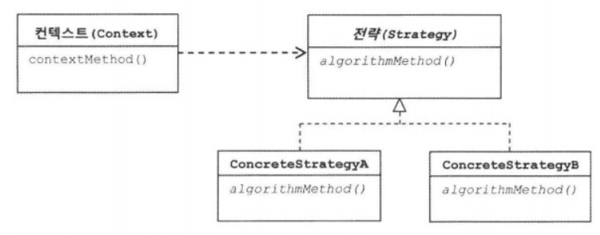
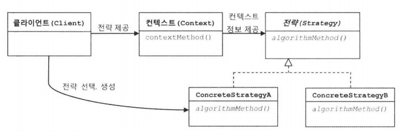
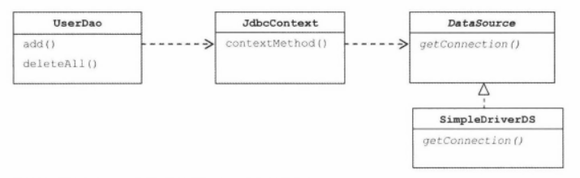
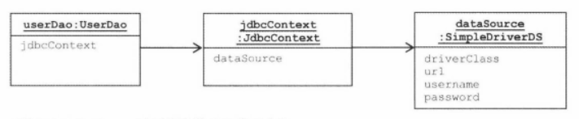
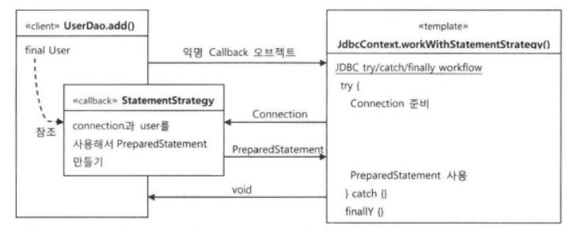

# 3장 - 템플릿

## Intro

* 1장에서 한 일 다시 보기
  * 초난감 DAO
  * 관심사의 분리
  * 개방폐쇠 원칙(OCP)에 맞게 설계구조 변경
    * 코드에서 어떤부분은 변경을 통해 기능이 다양해지고 확장됨
    * 어떤부분은 고정되어 있으며 변하지 않으려는 성질
    * 구분해서 효율적인 구조를 만들어주는 것

* 템플릿 - 바뀌는 성질이 다른 코드 중에서 변경이 거의 일어나지 않으며 일정한 패턴으로 유지되는 특성을 가진 부분을 자유롭게 변경되는 성질을 가진 부분으로부터 독립시켜서 효과적으로 활용할 수 있도록 하는 방법

* 3장의 내용
  * 스프링에 적용된 템플릿 기법을 살펴보기
  * 템플릿을 이용해 완성도 있는 DAO 만들기

## 3.1. 다시보는 초난감 DAO

### 3.1.1. 예외처리 기능을 갖춘 DAO

* 그동안 신경쓰지 않았던 부분 - 예외처리
  * DB 커넥션이라는 제한적인 리소스를 공유해 사용하는 JDBC 코드에는 어떤 이유로든 예외 발생시 사용한 리소스를 반드시 반환하도록 만들어야 함
  * 현재 UserDao의 코드는 중간에 예외 발생시 connection을 닫지 못하는 문제가 있다.
  * connection 자원이 반환되지 못하면 커넥션 풀 자원을 사용하지 못하고 리소스 부족 오류를 내며 서버가 중단되는 사태가 벌어진다.
  * 장시간 사용되는 다중 사용자를 위한 서버에는 치명적이다.
  * 결론 - try / catch / finally 구문으로 감싸고 어떤 상황이든 close()를 부를수 있게 한다.

* JDBC 수정 기능의 예외 처리(코드 참고)
* JDBC 조회 기능의 예외 처리(코드 참고)

## 3.2. 변하는 것과 변하지 않는 것

### 3.2.1. JDBC try / catch / finally 코드의 문제점

* 문제점
  * 복잡한 try/catch/finally 블럭이 2중으로 나옴
  * UserDao 모든 메소드에 반복
* 근시안적인 해결방법 - Copy & Paste
  * 사람의 손으로 편집하다가 실수할 가능성 다분
  * 테스트를 돌려도 잘 된다. 당장에 문제가 없어보이는게 더 큰 문제
  * 옛날 이야기
    * 1주일에 한번씩 DB 커넥션 풀이 꽉 차는 문제발생
    * 전문 컨설턴트의 해결책 - 수백개의 DAO 코드를 A4에 출력해 하나씩 형광펜으로 체크함
    * 몇군데 close() 호출이 잘못된 곳을 찾아 변경

* 그럼 어떻게 효과적으로 해결 해야할까?
  * 변하지 않는, 중복되는 코드와 확장되고 자주 변하는 코드를 분리해야 한다.
  * 1장의 DAO와 DB연결기능 분리와 원리는 같으나 성격이 다르므로 해결 방법도 조금 다르다.

### 3.2.2. 분리와 재사용을 위한 디자인 패턴 적용

* 변하는 부분 
  * SQL 적용부분 
  * 결과를 가져가는 부분
* 변하지 않는 부분
  * try / catch 구문
  * close() 호출

* 메소드 추출
  * 변하는 부분 - 메소드가 추출된 부분
  * 변하지 않는 부분 - 원래 메소드
  * 변하지 않는 부분을 재사용해야 하는데, 변하는 부분이 재사용하기 쉬운 구조가 되었다. 반대로 되어서 적용 실패
* 템플릿 메소드 패턴 적용
  * 상속을 이용한 확장 구조
  * 변하지 않는 부분 - 상위 클래스
  * 변하는 부분 - 하위 클래스
  * Dao의 기능이 생길 때마다 class를 추가해주어야 하는 문제 - 배보다 배꼽이 큼
* 전략 패턴의 적용
  * 오브젝트를 아예 둘로 분리하고 클래스 레벨에서는 인터페이스를 통해서만 의존
  * 확장에 해당하는 변하는 부분을 별도의 클래스로 만들어 추상화된 인터페이스를 통해 위임하는 방식
  * 변하지 않는 부분 - context(맥락)
  * 변하는 부분 - strategy(전략)
  * 장점
    * 개방 폐쇄 원칙을 잘 지킴
    * 템플릿 메소드 패턴보다 유연하고 확장성이 뛰어남

  

  * deleteAll() 컨텍스트 정리
    * DB 커넥션 가져오기
    * **PreparedStatement를 만들어줄 외부 기능 호출하기 - 전략**
    * 전달받은 PreparedStatement 실행하기
    * 예외가 발생하면 이를 다시 메소드 밖으로 던지기
    * 모든 경우에 만들어진 PreparedStatement와 Connection을 적절히 닫아주기
  * StatementStrategy 라는 인터페이스로 전략을 정의한다.
  ```java
    package springbook.user.dao;
    ...
    public interface StatementStrategy {
        PreparedStatement makePrearedStatement(Connection c) throws SQLException;
    }
  ```
  * 이 인터페이스를 상속하여 실제 바뀌는 코드 부분을 클래스로 만든다.
  ```java
    package springbook.user.dao;
    ...
    public class DeleteAllStatement implements StatementStrategy{
      @Override
      public PreparedStatement makePrearedStatement(Connection c) throws SQLException {
          PreparedStatement ps = c.prepareStatement("delete from users");
          return ps;
      }
    }
  ```
  * 마지막 바뀌지 않는 부분(맥락) 에 적용한다.
  ```java
    public void deleteAll() throws SQLException {
      ...
      try {
          c = dataSource.getConnection();

          StatementStrategy strategy = new DeleteAllStatement();
          ps = strategy.makePrearedStatement(c);

          ps.executeUpdate();
      } catch (SQLException e){
      ...
  ```
  * 하지만 이렇게 Context 안에서 이미 구체적인 전략 클래스인 DeleteAllStatement 가 고정되어 있으면 전략패턴의 취지를 살리지 못함
  * Context 가 어떤 전략을 사용할지 정하는 것은 Context 를 사용하는 Client 가 결정하는게 더 유연한 디자인이 된다.

  

  * 위와같은 방식으로 되려면? StatementStrategy를 컨텍스트 메소드의 파라메터로 지정하면 해결된다.

  * 메소드로 분리한 try/catch/finally 컨텍스트 코드
  ```java
    public void jdbcContextWithStatementStrategy(StatementStrategy stmt) throws SQLException {
      Connection c = null;
      PreparedStatement ps = null;

      try {
          c = dataSource.getConnection();

          ps = stmt.makePrearedStatement(c);

          ps.executeUpdate();
      ...
  ```
  * 클라이언트 책임을 담당할 deleteAll() 메소드
  ```java
    public void deleteAll() throws SQLException {
        StatementStrategy st = new DeleteAllStatement();
        jdbcContextWithStatementStrategy(st);
    }
  ```

  * 어느정도의 전략패턴의 모습을 갖추었다!

## 3.3. JDBC 전략 패턴의 최적화

### 3.3.1. 전략 클래스의 추가 정보

* UserDao의 add() 메서드 적용
  * add() 도 동일한 과정을 거침
  * 차이점은 add 할 대상 User 오브젝트를 StatementStrategy의 생성자에서 받음

### 3.3.2. 전략과 클라이언트와의 동거

* 현재의 불만점
  * DAO 메소드마다 새로운 StatementStrategy 구현 클래스가 만들어져야 한다
  * add()메소드의 User 처럼 부가정보가 필요할 경우에 오브젝트를 전달 받는 생성자와 이를 저장해둘 인스턴스 변수를 번거롭게 만들어야 함
* 해결책
  * 로컬 클래스
    * StatementStrategy 구현 클래스를 UserDao 클래스 안의 내부 클래스로 구현함
    * 어짜피 특정 StatementStrategy 구현 클래스는 UserDao의 메소드 로직과 강하게 결합되어 있기 때문
    * 로컬 클래스는 선언된 클래스 안에서만 사용할 수 있다
    * 또한 로컬클래스는 내부 클래스이기 때문에 자신이 선언된 곳의 정보에 접근할 수 있음
      * User 직접 전달 필요없음(User final 선언 후 접근가능)
  ```java
    public void add(final User user) throws SQLException {
        class AddStatement implements StatementStrategy{

            @Override
            public PreparedStatement makePreparedStatement(Connection c) throws SQLException {
                PreparedStatement ps = c.prepareStatement("insert into users(id, name, password) values(?, ?, ?)");
                ps.setString(1, user.getId());
                ps.setString(2, user.getName());
                ps.setString(3, user.getPassword());
                return ps;
            }
        }
        StatementStrategy st = new AddStatement();
        jdbcContextWithStatementStrategy(st);
    }
  ```

  * 익명 내부 클래스
    * 이름을 붙이지 않은 클래스
    * 클래스 선언과 오브젝트 생성이 결합된 형태로 만들어짐
    * 클래스를 재사용할 필요가 없고 구현한 인터페이스 타입으로만 사용할 경우에 유용
    * 좀 더 간략하게 익명 내부클래스로 add() 와 deleteAll() 을 변경한다

## 3.4. 컨텍스트와 DI

### 3.4.1. JdbcContext의 분리

* 현재까지의 상황 정리
  * 클라이언트 - UserDao의 메소드
  * 개별 전략 - 익명 내부 클래스
  * 컨텍스트 - jdbcContextWithStatementStrategy() 메소드
* jdbcContextWithStatementStrategy() 는 다른 DAO 에서도 사용 가능하다.
* jdbcContextWithStatementStrategy() 를 UserDao에서 분리하면 다른 DAO도 쓸수 있다.
* 소스코드 참조





* (주의)아직 모든 UserDao의 모든 메소드가 JdbcContext를 사용하는 것은 아님!

### 3.4.2. JdbcContext의 특별한 DI

* 스프링 bean으로 DI
  * 인터페이스가 아닌 JdbcContext를 DAO 에 DI 해도 되는걸까? 인터페이스로 DI 해야하지 않을까?
  * JdbcContext같이 클래스를 직접 DI 구조로 가야하는 이유
    * JdbcContext를 싱글톤 빈으로 만들어야 하기 때문 (일종의 Service 오브젝트 성격)
    * JdbcContext가 DI 를 통해 다른 bean(DataSource)에 의존하기 때문
      * 스프링에서 DI를 하기 위해서 주입되는 오브젝트와 주입받는 오브젝트 둘다 bean으로 등록되어 있어야 함
    * 인터페이스가 없는 이유는? JdbcContext와 Dao 사이에 강한 응집도를 가지기 때문
  * But! 인터페이스 없이 클래스를 DI하는 상황은 늘 차선책으로 생각하고 개발할 것을 권유

* 코드를 이용하는 수동 DI
  * JdbcContext를 스프링 bean으로 등록하지 않고, UserDao 내부에서 직접 생성후 DI하는 방식
  * 수동 DI 시 문제 2가지
    * 문제점1. 싱글톤으로 만들 수 없다.
      * Dao에서 생성하는 방식이기 때문에 Dao갯수만큼 JdbcContext객체를 생성함
      * 왠만한 대형 프로젝트라도 수백개 이상은 만들어지지 않을 것
      * 따라서 용인될 만한 수준
      * 빈번히 오브젝트가 만들어지고 제거되는 것도 아니니 GC에 무리 없음
    * 문제점2. DataSource는 어떻게 DI 받나?
      * JdbcContext 자신이 Bean이 아니니 DataSource를 DI 받을 수 없음
      * 해결책 JdbcContext에 대한 제어권을 가지고 생성과 관리를 담당하는 UserDao에게 DI를 맞기는 것
  * 수동 DI를 하는 이유
    * 굳이 인터페이스를 두지 않아도 될 만큼 긴밀한 관계인 DAO클래스와 JdbcContext를 어색하게 빈으로 분리하지 않고 내부에서 직접 만들어 사용하면서 다른 오브젝트에 대한 DI를 적용할 수 있기 때문
    * JdbcContext와 UserDao의 관계를 외부에 드러내지 않고 사용 가능하게 하는 것이 목적
    * 그러나 싱글톤 문제와 DI 작업의 부차적 코드가 필요함은 단점

## 3.5. 템플릿과 콜백

* 전략 패턴의 기본 구조에 익명 내부 클래스를 활용한 방식 - 템플릿/콜백 패턴
  * 전략 패턴의 컨텍스트 - 템플릿
  * 익명 내부 클래스로 만들어지는 오브젝트 - 콜백

### 3.5.1. 템플릿 콜백의 동작원리

* 템플릿 - 고정된 작업 흐름을 가진 코드를 재사용
* 콜백 - 템플릿 안에서 호출되는 것을 목적으로 만든 오브젝트

* 특징
  * 콜백 - 보통 단일 메소드 인터페이스 사용
    * 템플릿의 작업흐름 중 특정기능을 위해 한 번 호출되는 경우기 일반적이기 때문
  * 콜백 인터페이스의 파라메터 - 템플릿의 작업흐름 중에 만들어지는 컨텍스트 정보를 전달받을 때 사용
    * 예) makePreparedStatement() 의 Connection 객체, connection은 workWithStatementStrategy() 메소드 내에서 생성되어 전달된다.
  * DI 방식의 전략 패턴 구조
  * 클라이언트가 템플릿 메소드를 호출하면서 콜백 오브젝트를 전달하는 것은 메소드 레벨에서 일어나는 DI이다
  * 전략패턴과 DI의 장점을 익명 내부 클래스 사용 전략과 결합한 독특한 활용법



### 3.5.2. 편리한 콜백의 재활용

* 콜백의 분리와 재활용
  * 콜백조차도 반복되는 패턴이 있다 - 단순히 prepareStatement메소드 내 sql파라메터만 바뀌는 경우가 많음
  * 중복되는 부분과 변화되는 부분을 분리

  ```java
    public void deleteAll() throws SQLException {
        executeSql("delete from users");
    }
  ```

  ```java
    private void executeSql(final String query) throws SQLException {
        jdbcContext.workWithStatementStrategy(new StatementStrategy() {
            @Override
            public PreparedStatement makePreparedStatement(Connection c) throws SQLException {
                PreparedStatement ps = c.prepareStatement(query);
                return ps;
            }
        });
    }
  ```

* 콜백과 템플릿의 결합
  * 한 단계 더 나아가 executeSql메소드는 다른 DAO 에서도 사용 될 수 있다.
  * 그렇다면 JdbcContext로 옮겨서 사용하게 하는게 어떨까?

  ```java
    public void deleteAll() throws SQLException {
        this.jdbcContext.executeSql("delete from users");
    }
  ```

  ```java
  public class JdbcContext {
    ...
    public void executeSql(final String query) throws SQLException {
        workWithStatementStrategy(new StatementStrategy() {
            @Override
            public PreparedStatement makePreparedStatement(Connection c) throws SQLException {
                PreparedStatement ps = c.prepareStatement(query);
                return ps;
            }
        });
    }
    ...
  }
  ```
* 일반적으로 성격이 다른 코드들은 가능한 분리하지만, 반대로 하나의 목적을 위해 서로 긴밀하게 연결되어 동작하는 응집력이 강한 코드들은 한 군데 모여 있는 것이 유리

### 3.5.3. 템플릿/콜백의 응용

* 스프링은 이 템플릿/콜백 패턴을 적극적으로 응용함
* 스프링에는 다양한 자바 엔터프라이즈 기술에서 사용할 수 있도록 미리 만들어져 제공되는 수십 가지 템플릿/콜백 클래스와 API 가 존재
* 스프링이 내장된 것을 원리도 알지 못한 채 기계적으로 사용하는 경우와 적용된 패턴을 이해하고 사용하는 경우는 큰 차이가 있음
* 고정된 작업흐름을 가지고 여기저기 자주 반복되는 코드가 있다면, 중복되는 코드를 분리할 방법을 생각해보는 습관을 기르자
* 중복된 코드를 먼저 메ㅔ소드로 분리하는 간단한 시도를 해본다
* 일부 작업을 필요에 따라 바꾸어 사용해야 한다면? 인터페이스를 사이에 두고 분리해서 전략 패턴을 적용한다
* 바뀌는 부분이 한 애플리케이션 안에서 동시에 여러 종류가 만들어질 수 있다면 템플릿/콜백 패턴을 적용한다
* 대표적 템플릿/콜백 패턴 후보 - try/catch/finally 블록을 사용하는 코드
* calcSum() 예제를 통해 템플릿/콜백 패턴 변환과정 복습(소스코드 참조)

* calcSum에 try/catch/finally 적용

* 중복의 제거와 템플릿/콜백 설계
  * 추가 요구사항 - 모든 숫자의 곱을 계산하는 기능, 그리고 파일에 담긴 숫자를 다양한 방법으로 처리하는 기능이 대거 추가될 예정..
  * 어떻게 대처할 것인가? 복붙(복사해서 붙여넣기)? NO...
  * 여기도 템플릿/콜백 패턴 적용
    * 템플릿-콜백 둘 사이의 경계정하기
    * 템플릿 -> 콜백 전달해줄 내부의 정보는?
    * 콜백 -> 템플릿 돌려줄 내용은?
  * BufferedReader를 전달 받아 결과값을 돌려주는 콜백 적용
  * 숫자의 합 / 숫자의 곱 기능 같이 사용

* 템플릿/콜백의 재설계
  * calcSum()과 calcMultiply() 에 나오는 두 개의 콜백을 비교해 보면 유사한 부분(중복)이 또 보임
  * 실제로는 각 라인을 읽어들일 때 최종결과에 어떻게 반영하느냐 하는 코드만 다름
  * 또 한번 라인별 콜백을 추가하는 리팩토링을 거쳐 중복을 최소화 해보자!(코드 참고)

* 제네릭스를 이용한 콜백 인터페이스
  * 좀 더 강력한 템플릿/콜백 구조를 만들려면?
  * 현재까지는 결과를 Integer 타입만 가능하게 고정되어 있음
  * 결과 타입을 다양하게 하고 싶다면? Generics(제네릭스)를 이용해 보자(코드 참고)

## 3.6. 스프링의 JdbcTemplate

* 이제까지 원리를 이해하기 위한 과정이었다. 모두 수고하셨습니다.
* 하지만 스프링은 이미 DAO에서 사용할수 있는 jdbc용 템플릿이 이미 구현되어 있음
* JdbcTempate - 스프링이 제공하는 JDBC 코드용 기본 템플릿
* 지금까지 했던 JdbcContext는 버리고 JdbcTempate으로 변경하자!(소스 참고)

### 3.6.1. update()

* 앞서 만든 executeSql() 과 비슷한 메소드가 JdbcTemplate의 update()라는 메소드로 존재한다
* 앞에서 구상만 하고 실제로 만들지 못했던 add() 메소드에 대한 편리한 템플릿 메소드도 제공됨.
* 치환자(?) 를 가진 SQL 로 PremaredStatement를 만들고 함께 제공함

### 3.6.2 queryForInt()

* getCount()는 SQL 쿼리를 실행하고 ResultSet을 통해 결과 값을 가져오는 코드
* 콜백이 2개 등장하는 조금 복잡해 보이는 구조
* 첫번째 PreparedStatementCreator 콜백은 템플릿으로부터 Connection을 받고 PreparedStatement를 돌려줌
* 두 번째 ResultSetExtractor 콜백은 템플릿으로부터 ResultSet을 받고 거기서 추출한 결과를 돌려줌
* 결국 2번째 콜백에서 리턴하는 값은 결국 템플릿 메소드의 결과로 다시 리턴됨
* ResultSetExtractor는 제너릭스 타입 파라미터를 갖는다
* 즉 유연하고 재사용하기 쉬운 구조로 잘 되어있다
* 이 제법 복잡해 보이는 구문도 한 줄로 바꿀 수 있다.(queryForInt로)
* **그러나 queryForInt() 메소드는 에석하게 스프링 3.2.2. 이후로는 Deprecated 되어 버렸다**
* 대신 queryForObject()로 대신할 수 있다.

```java
  public int getCount() throws SQLException {
    return this.jdbcTemplate.queryForObject("select count(*) from users", Integer.class);
  }
```

### 3.6.3. queryForObject()

* 마지막으로 get() 메소드에 jdbcTemplate 을 적용하기(코드 참고)
  * SQL에 바인딩이 필요한 치환자 필요
  * ResultSet 을 Uesr 오브젝트로 변환
  * ResultSetExtractor대신 RowMappper 콜백 사용
    * 공통점 - 템플릿으로부터 ResultSet을 받아 필요한 정보를 추출한다
    * 차이점
      * ResultSetExtractor는 한 번 전달받아 알아서 추출 작업 진행
      * ResultSet 로우 하나를 매핑하기 위해 사용. row수 만큼 여러번 호출됨

### 3.6.4. query()

* getAll() 메소드 추가 - 테이블의 모든 User 로우를 가져온다
* List<User> 타입으로 돌려줌
* 먼저 getAll()을 검증하는 Test code 부터 작성(코드 참조)
* getAll은 RowMapper 콜백 오브젝트에서 ResultSet에서 User로 변환하는 로직 작성
* 기능 완성후 테스트 수행해보면 깔끔하게 성공한다.

* 테스트 보완
  * 만약 getAll의 결과가 없다면?
    * null ?? Exception ?? 정하기 나름
  * JdbcTempate의 query()는 결과가 없을 경우 크기가 0 인 List<T> 오브젝트 반환
  * 이미 스프링에서 동작이 정해진 코드도 굳이 검증코드를 추가해야 하나?
    * 테스트에서 관심있는 것은 getAll() 메소드의 실행 결과
    * 중간에 getAll()의 구현을 바꿀 수도 있음. 그래서 test 코드는 필요
    * 내부적으로 query()를 사용했다고 해도 결과를 getAll() 에서 바꿔서 구현했을 수도 있음

### 3.6.5. 재사용 가능한 콜백의 분리

* 이제 UserDao 코드는 처음 try/catch/finally가 덕지덕지 붙여있을 때의 메소드 1개 분량밖에 되지 않음
* 각 메소드의 기능 파악도 쉬움
* 핵심적인 SQL 문장, 파라메터, 생성 결과 타입정보만 남기에 코드를 파악하기 쉬움

* DI 를 위한 코드 정리 - 필요없는 DataSource 인스턴스 변수 제거

* 중복 제거
  * 코드를 보면 get()과 getAll()의 RowMapper의 내용이 똑같음
  * 하나의 User테이블 row를 User오브젝트로 변환하는 로직은 자주 사용될 것으로 예상된다
  * 그리고 향후 User 테이블의 필드 수정,추가가 발생하면 같은 역할의 중복 RowMapper가 있다면 빼먹기 쉽다
  * 현재 콜백을 메소드에 분리해 중복을 제거후 재사용해 보자(코드 참조)
  * 이제 군더더기 없는 UserDao 코드가 완성되었다!

* 탬플릿/콜백 패턴과 UserDao
  * UserDao - User 정보를 DB에 넣거나 가져오거나 조작하는 방법에 대한 핵심적인 로직이 담김
  * JdbcTemplate - JDBC API를 사용하는 방식, 예외처리, 리소스의 반납, DB연결을 어떻게 가져올지에 관한 책임과 관심
  * UserDao와 JdbcTemplate 사이에는 강한 결합을 가지고 있음
  * 여기서 더 개선 가능한가?
    * userMapper가 인스턴스 변수로 설정되어 있고, 한 번 만들어지면 변경 불가능
      * 중도 변경 가능하게 UserMapper를 독립된 빈으로 만들고 DI 하게 만들면?
    * DAO 내 사용중인 SQL문장을 코드가 아니라 외부 리소스에 담고 이를 읽어와 사용하게 하는 것(이후 장에서 다루게 됨)

## 3.7 정리

* JDBC와 같은 예외가 발생할 가능성이 있으며 공유 리소스의 반환이 필요한 코드는 반드시 try/catch/finally 블록으로 관리해야 한다.
* 일정한 작업 흐름이 반복되면서 그중 일부 기능만 바뀌는 코드가 존재한다면 전략 패턴을 적용한다. 바뀌지 않는 부분은 컨텍스트로, 바뀌는 부분은 전략으로 만들고 인터페이스를 통해 유연하게 전략을 변경할 수 있도록 구성한다.
* 같은 애플리케이션 안에서 여러 가지 종류의 전략을 다이내믹하게 구성하고 사용해야 한다면 컨텍스트를 이용하는 클라이언트 메소드에서 직접 전략을 정의하고 제공하게 만든다.
* 클라이언트 메소드 안에 익명 내부 클래스를 사용해서 전략 오브젝트를 구현하면 코드도 간결해지고 메소드의 정보를 직접 사용할 수 있어 편리하다.
* 컨텍스트가 하나 이상의 클라이언트 오브젝트에 사용된다면 클래스를 분리해서 공유하도록 만든다.
* 컨텍스트는 별도의 빈으로 등록해서 DI 받거나 클라이언트 클래승서 직접 생성해서 사용한다. 클래스 내부에서 컨텍스트를 사용할 때 컨텍스트가 의존하는 외부의 오브젝트가 있다면 코드를 이용해서 직접 DI 해줄 수 있다.
* 단일 전략 메소드를 갖는 전략 패턴이면서 익명 내부 클래스를 사용해서 매번 전략을 새로 만들어 사용하고, 컨텍스트 호출과 동시에 전략 DI를 수행하는 방식을 템플릿/콜백 패턴이 라고 한다.
* 콜백의 코드에도 일정한 패턴이 반복된다면 콜백을 템플릿에 넣고 재활용하는 것이 편리하다.
* 템플릿과 콜백의 타입이 다양하게 바뀔 수 있다면 제네릭스를 이용한다.
* 스프링은 JDBC 코드 작성을 위해 JdbcTemplate을 기반으로 하는 다양한 템플릿과 콜백을 제공한다.
* 템플릿은 한 번에 하나 이상의 콜백을 사용할 수도 있고, 하나의 콜백을 여러 번 호출할 수도 있다.
* 템플릿/콜백을 설계할 때는 템플릿과 콜백 사이에 주고받는 정보에 관심을 둬야 한다.