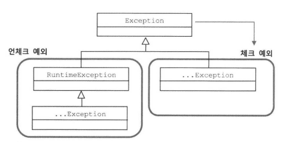
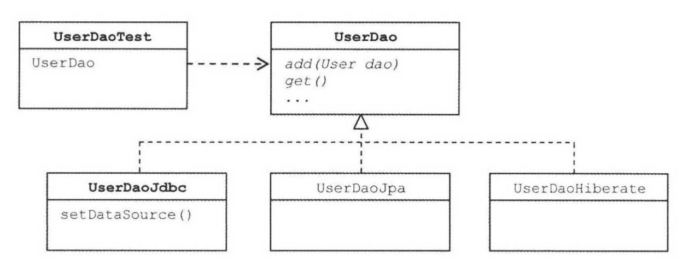

# 4장 - 예외

## Intro

* 개발자가 신경쓰기 귀찮은 영역 - 예외처리
* 이번 장에서는...
  * 스프링의 데이터 엑세스 기능의 예외처리
  * 예외를 처리하는 베스트 프랙티스

## 4.1. 사라진 SQLException

```java
    public void deleteAll() throws SQLException {
        this.jdbcContext.executeSql("delete from users");
    }
```

```java
    public void deleteAll() {
        this.jdbcTemplate.update("delete from users");
    }
```

* SQLException 의 행방은?

### 4.1.1. 초난감 예외처리

* 대표적인 초난감 예외처리 대표주자들!
  * 예외 블랙홀
    ```java
        try {

        } catch(SQLException e){
        }
    ```
    * 예외를 받고 아무것도 하지 않음
    * 발생한 예외를 무시해버리는 상황 발생
    * 이런 코드를 작성시 문제는 나중에 오류가 있어 예외발생시 어디에서 문제가 생기는지 전혀 알수 없게 되버린다는 점이다.
    ```java
    } catch(SQLException e){
        System.out.println(e);
    }
    ```

    ```java
    } catch(SQLException e){
        e.printStackTrace();
    }
    ```
    * 위의 둘도 문제가 많음
    * 콘솔 로그에만 찍히게 되는데, 누가 직접 콘솔을 계속 보고 있지 않는 한 이 메시지를 볼수 없다.
    * SQLException의 발생 이유
      * SQL문법에러
      * DB에서 처리할수 없을 정도의 데이터 액세스 로직에 심각한 버그
      * 서버가 죽음 혹은 네트워크가 끊김
    * 최소한 이렇게라도 해야 함
    ```java
    } catch(SQLException e){
        e.printStackTrace();
        System.exit(1);
    }
    ```

  * 무의미하고 무책임한 throws
    * 메소드 선언에 throws Exception을 기계적으로 붙임
    ```java
        public void method1() throws Exception {
            method2();
        }
        public void method2() throws Exception {
            method3();
        }
        public void method3() throws Exception {
            ...
        }
    ```
    * 남용하면 throw 선언이 의미없어져 버림. 
    * 실행 중 정말 예외 상황이 발생할 수 밖에 없는 메소드인지 부르는(사용하는) 쪽에선 알수 없게 되어버림
* 예외처리를 할때 반드시 지켜야 될 핵심 원칙(둘중에 하나가 되어야...)
  * 예외는 적절하게 복구
  * 작업을 중단시키고 운영자 또는 개발자에게 분명하게 통보

### 4.1.2. 예외의 종류와 특징

* 어떻게 처리해야 하는가? 오랫동안 논쟁이 되온 부분
* 특히 체크 예외(cheched exception)의 명시적으로 처리가 필요한 예외를 다루는 방법이 큰 이슈였음

* 예외는 크게 3가지 종류
  * Error
    * java.lang.Error 클래스와 그 서브 클래스
    * VM에서 비정상적인 상황 발생할 경우
    * 애플리케이션에서 해결할 수 없는 상황인 경우(OutOfMemoryError ThreadDeath 등)
    * 개발자가 신경쓰지 않아도 됨
  * Exception

    

    * java.lang.Exception 클래스와 그 서브 클래스
    * 애플리케이션 코드 작업중에 예외상황이 발생할 경우에 사용
    * 다시 체크예외와 언체크 예외로 나뉨
      * Exception과 체크 예외
        * RuntimeException을 상속하지 않음
        * 반드시 catch문으로 예외를 잡아 처리하거나 throws 선언이 필요
      * RuntimeException과 언체크/런타임 예외
        * RuntimeException 클래스와 그 서브 클래스
        * 명시적인 예외처리를 강제하지 않음. 즉 catch 문이나 throws 선언을 꼭 하지 않아도 됨
        * 주로 프로그램의 오류가 있을 때 발생하도록 의도한 것 - 예) NullPointerException

### 4.1.3. 예외처리 방법

* 예외 복구
  * 예외상황을 파악하고 문제를 해결해서 정상 상태로 돌려놓는 것
  * 예1) 사용자가 요청한 파일을 읽으려고 시도했는데 해당 파일이 없다거나 다른 문제가 있어 IOException이 발생
    * 사용자에게 다른 파일을 이용하도록 안내함
  * 예2) 네트워크가 불안해서 가끔 접속이 안되는 시스템. 원격DB 서버 접속 실패해서 SQLException이 발생한 경우
    * 일정 시간 대기후 접속 재시도. 이것을 정해진 횟수만큼 시도. 실패했다면 복구 포기

```java
    int maxretry = MAX_RETRY;
    while(maxretry -- >0) {
        try {
            ...     // 예외가 발생할 가능성이 있는 시도
            return; // 작업 성공
        catch(SomeException e) {
            // 로그 출력. 정해진 시간만큼 대기
        finally {
            // 리소스 반납. 정리 작업
        }
        throw new RetryFailedException(); // 최대 재시도 횟수를 넘기면 직접 예외 발생.
```

* 예외 처리 회피
  * 예외처리를 자신이 담당하지 않고 자신을 호출한 쪽으로 던져버리는 것
  * throws문으로 선언해서 예외가 발생하면 알아서 던저지게 하거나 catch문으로 일단 예외를 잡은 후에 로그를 남기고 다시 예외를 던지는 것(rethrow)
  * 자신이 사용하는 쪽에서 예외를 다루는게 최선의 방법일 때 사용
  * 예) JdbcTemplate에서 사용하는 콜백 오브젝트는 ResultSet이나 PrepareStatement 등을 이용해서 작업하다 발생하는 SQLException을 자신이 처리하지 않고 템플릿으로 던져버림
    * SQLException 처리는 콜백오브젝트의 역할이 아니라 템플릿의 역할이라고 생각하기 때문
  * 이와같이 명확히 예외를 다루는 것이 자신이 사용하는 쪽에서 해야한다고 판단될때 써야한다.

  * 예외처리 회피 1

```java
    public void add() throws SQLException {
        // JDBC API
    }
```

* 예외처리 회피2

```java
    public void add() throws SQLException {
        try {
            // JDBC API
        } catch(SQLException e) {
            // 로그 출력
            throw e;
        }
    }
```

* 예외 전환(exeception translation)
  * 발생한 예외를 그대로 넘기지 않고 적절한 예외로 전환해 던짐
  * 보통 2가지 목적으로 사용
    * 내부에 발생한 예외를 좀더 적절하고 분명한 의미를 가진 예외로 바꿔서 던지기 위해
      * 예) 새로운 사용자를 등록하려고 시도했을 때 아이디가 같은 사용자가 있어 DB에서 JDBC API의 SQLException 발생시킴. DAO에서는 이 정보를 좀더 의미있게 해석해서 SQLException에러를 잡아서 DuplicationUserIdException 같은 예외를 정의해서 던짐.
    * 예외를 처리하기 쉽고 단순하게 만들기 위해 포장하는 것
      * 예외처리를 강제하는 체크예외를 언체크 예외(런타임 예외)로 바꾸는 경우
      * 대부분 서버환경에서는 애플리케이션 코드에서 처리하지 않고 전달된 예외들을 일괄적으로 다룰수 있는 기능을 제공함
      * 어차피 복구못할 예외라면 애플리케이션 코드에서는 런타임 예외로 포장해서 던지고 예외처리 서비스 등을 이용해 로그를 남기고, 관리자에게 메일로 통보, 사용자에게 안내 메시지를 보여주는 것이 바람직

  * 체크 예외를 언체크 예외로 포장해서 던짐(SQLException -> EJBException)

```java
    try {
        OrderHome orderHome = EJBHomeFactorY.getlnstance().getOrderHome();
        Order order = orderHome.findByPrimaryKey(Integer id);
    } catch (NamingException ne) (
        throw new EJBException(ne);
    } catch (SQLException se) (
        throw new EJBException(se);
    } catch (RemoteException re ) (
        throw new EJBException(re)
    }
```

### 4.1.4. 예외처리 전략

* 런타임 예외의 보편화
  * 일반적으로 
    * 체크 예외 - 일반적 예외
    * 언체크 예외 - 시스템 장애나 프로그램상의 오류에 사용
  * 예외처리 강제
    * API 사용하는 개발자의 실수 방지를 위한 배려일수도
    * 예외를 다루고 싶지 않은 귀차니즘의 원인 일수도
  * 애플릿, AWT, 스윙 - 독립형 어플리케이션
    * 통제 불가능한 시스템 예외라도 애플리케이션의 작업이 중단되지 않게 해주고 상황을 최대한 복구해야함
  * 자바 엔터프라이즈 서버 환경
    * 수많은 사용자 동시 요청을 처리해야 함
    * 각 요청은 독립적 작업
    * 하나의 요청 처리중 예외 발생시 해당 작업만 중단하면 됨
    * 예외 발생시 사용자와 커뮤니케이션 하면서 복구할 수 있는 수단이 없음
    * 예외 상황을 미리 파악하고, 예외가 발생치 않도록 차단하는 게 좋음
    * 빨리 요청의 작업 취소 후, 서버 관리자나 개발자에게 통보해야 함
    * 즉 체크예외는 점점 사용도가 떨어지고 있음
    * 대부분 런타임 예외로 처리하는 경향
    * 언체크라도 언제든지 예외를 catch로 잡을수도 있음. 즉 선택적이라 더더욱 런타임 에러로 처리

* add() 메소드의 예외 처리

```java
    public void add(User user) throws DuplicateUserIdException, SQLException {
        try {
            // JDBC를 이용해 user 정보를 DB에 추가하는 코드 또는
            // 그런 기능을 가진 다른 SQLException을 던지는 메소드를 호출하는 코드
        } catch(SQLException e) {
            // ErrorCode가 MySQL의 "Duplicate Entry(1062)"이면 예외 전환
            if (e.QetErrorCode() == MysQIErrorNumbers.ER_DUP_ENTRY)
                throw new DuplicateUserIdException();
        } else
            throw e; // 그 외의 경우는 SQLException 그대로
```

  * SQLException 은 대부분 복구 불가능한 예외이므로 throws 를 계속 이어가게 해는 것 보다 런타임 예외로 포장해 주는 것이 좋다.
  * DuplicateUserIdException 도 굳이 체크 예외로 둘 필요가 없음. 어디에서는 잡아 처리할 수 있기 때문.
  * 다만 명시적으로 throws는 선언하는게 좋음. 그래야 add() 메소드를 사용하는 개발자엑 의미 있는 정보가 전달됨
  * 둘다 언체크 에외로 변환시키면 다음과 같이 코드를 바꿔야 함

  * DuplicateUserldException 을 런타임 예외로 구현
  ```java
    public class DuplicateUserldException extends RuntimeException {
        public DuplicateUserldException(Throwable cause) {
            super (cause);
        }
    }
  ```

  * add() 메소드 코드

  ```java
    public void add(User user) throws DuplicateUserIdException {
        try {
            // JDBC를 이용해 user 정보를 DB에 추가하는 코드 또는
            // 그런 기능을 가진 다른 SQLException을 던지는 메소드를 호출하는 코드
        } catch(SQLException e) {
            if (e.QetErrorCode() == MysQIErrorNumbers.ER_DUP_ENTRY)
                throw new DuplicateUserIdException(e); // 예외 전환
        } else
            throw new RuntimeException(e); // 예외 포장
  ```

* 낙관적인 예외처리 기법
  * 복구할 수 있는 예외는 없다는 가정
  * 어짜피 시스템 레벨에서 알아서 처리
  * 꼭 필요한 경우는 런타임 예외라도 잡아서 복구함
* 비관적인 예외처리 기법
  * 일단 잡고 보도록 강제하는 체크 예외

* 애플리케이션 예외
  * 애플리케이션 자체의 로직에 의해 의도적으로 발생시키고 반드시 catch해서 조치를 취하도록 요구하는 예외
  * 예제) 사용자가 요청한 금액을 은행계좌에서 출금하는 기능을 가진 메소드
    * 대략적인 로직
      * 현재 잔고 확인
      * 허용하는 범위를 넘어선 출금 요청시 출금작업 중단
      * 경고를 사용자에게 보냄
    * 메소드를 설계하는 2가지 방법
      * 첫번째, 정상적인 출금처리를 했을 경우와 잔고 부족이 발생했을 경우에 각각 다른 종류의 리턴 값을 돌려준다.
        * 정상 출금 - 리턴값이 요청금액 자체
        * 잔고 부족 - 0또는 -1 같은 특별값 리턴
        * 문제점
          * 리턴값을 명확하게 코드화 하지 않으면 혼란이 생김
          * 결과 값을 확인하는 조건문이 자주 등장함. 코드가 지저분해지고 흐름파악 힘듦.
      * 두번째, 정상적 흐름을 따르는 코드는 그대로 두고, 잔고 부족과 같은 예외상황에서는 비즈니스적인 의미를 띈 예외를 던지도록 한다.
        * 잔고 부족인 경우 - InsufficientBalenceException등을 던짐
        * 의도적으로 체크예외를 둠 - 개발자가 잊지않고 특정상황에 대한 처리를 하게 함

      ```java
        try {
            BigDecimal balance = account .withdraw(amount);
            ...
            // 정상적인 처리 결과를 출력하도록 진행
        catch(InsufficientBalanceException e) { // 체크 예외
            // InsufficientBalanceException에 담긴 인출 가능한 잔고금액 정보를 가져옴
            BigDecimal avai lFunds = e.getAvailFunds();
            ...
            // 잔고 부족 안내 메시지를 준비하고 이를 출력하도록 진행
        }
      ```

### 4.1.5. SQLException은 어떻게 되었나?

* SQLException은 복구 가능한 예외인가?
  * 99%의 경우 코드 레벨에서 복구할 방법이 없음
  * 대부분의 발생이유
    * 프로그램의 오류 또는 개발자의 부주의
      * SQL 문법이 틀림
      * 제약조건 위반
    * 통제할 수 없는 외부상황
      * DB 서버 다운
      * 네트워크 불안정
      * DB 커넥션 풀이 꽉 참
  * 결국 관리자나 개발자에게 예외 발생을 알리는 방법 밖에 없음
  * SQLException을 잡아서 무언가 처리할 것이 거의 없음
  * 가능한한 의미있는 언체크/런타임 예외로 전환해서 던지는 것이 나음
  * 스프링은 JdbcTemplate에서 이와같은 예외처리 전략을 따름
    * **(중요!)SQLException을 런타임 예외 DataAccessException으로 포장해 던짐**
    * 스프링을 사용하는 측은 꼭 필요한 경우에만 catch 해서 처리하면 됨

## 4.2. 예외 전환

* 예외 전환의 목적은 2가지
  * 런타임 예외로 포장해서 굳이 필요하지 않은 catch/throws를 줄여주는 것
  * 로우레벨의 예외를 좀 더 의미 있고 추상화된 예외로 바뀌서 던져주는 것
* 스프링 JdbcTemplate이 던지는 DataAccessException의 목적
  * SQLException을 런타임 예외로 포장해서 대부분 복구 불가능한 예외를 catch 하는 것을 없애줌
  * SQLException에서 다루기 힘든 상세한 예외정보를 의미있고 일관성 있는 예외로 전환해서 추상화해줌

### 4.2.1. JDBC의 한계

* JDBC를 만든 취지
  * DB별로 같은 표준 API 인터페이스를 만들어서 서로 호환되게 함. 즉 DB만 바꿔도 동작되게
  * 개발자가 단 하나의 표준 API를 익힐수 있도록 도움
* 그러나.. 현실적인 한계가 몇가지 있다
  * 비표준 SQL
    * 대부분의 DB가 비표준 문법과 기능이 있고, 이 비표준이 매우 폭넒게 사용됨
    * 예) 최적화 기법, 페이지 처리를 위한 로우 시작위치와 갯수, SQL 함수기능 등등...
    * JDBC를 믿고 DB 변경가능성을 고려하기엔 SQL 자체가 걸림돌
    * 결국 현실적으로 DAO를 DB별로 만들어 사용 혹은 SQL을 외부에 독립시켜서 바꿔 쓸수 있게 함
  * 호환성 없는 SQLException의 DB 에러 정보
    * DB에서 발생하는 예외의 원인은 매우 다양함
    * 문제는 DB마다 에러의 종류와 원인도 제각각
    * 그런데 JDBC는 그 제각각 예외를 SQLException 한 곳에 모두 담아서 처리
    * 예외가 발생한 원인은 SQLException 안의 에러 코드와 SQL 상태정보를 참조해야 한다
    * 문제는 이 에러 코드들이 DB종류별로 다 제각각이다. 아래와 같은 식으로 된다

    ```java
        if(e.getErrorCode() == MysqlErrorNumbers.ER_DUB_ENTRY) {...}
    ```

    * 즉 이말은 에러 코드와 상태 코드는 표준화되 되어 있지 않아 DB에 독립적인 코드 작성이 불가능하다

### 4.2.2. DB 에러 코드 매핑을 통한 전환

* 스프링은 DataAccessException 이라는 SQLException을 대체할 수 있는 런타임 예외를 정의
* DataAccessException의 서브클래스로 세분화된 예외 클래스들을 정의
  * SQL문법이 틀리면 발생 - BadSqlGrammerException
  * DB 커넥션을 가져오지 못했을 때 - DataAccessResourceFailureException
  * 데이터 제약조건을 위배했거나 일관성을 지키지 않는 작업을 수행했을 때 - DataIntegrityViolationException
  * 그 중 중복 키 때문에 발생한 경우 - DuplicationKeyException
* 문제는 DB마다 에러 코드가 원인은 같아도 다 제각각이라는 점
  * 스프링은 이런 문제를 대신 해결한다
  * 스프링은 DB별 에러 코드를 분류해서 스프링이 정의한 예외 클래스를 매핑해 놓은 에러코드 매핑정보 테이블을 만들어두고 이를 이용함
  * DB의 에러코드를 DataAccessException 계층구조의 클래스 중 하나로 매핑해줌
  * 결국 DB 가 달라져도 같은 종류의 에러라면 동일한 예외를 받을 수 있다.
* JdbcTemplate은 체크 예외인 SQLException을 런타임 예외인 DataAccessException 계층구조의 예외로 포장해주기 때문에 add() 메소드에는 예외 포장을 위한 코드가 따로 필요 없음
* 또, DB의 종류에 상관없이 중복 키로 인해 발생하는 에러는 DataAccessException의 서브클래스인 DuplicateKeyException으로 매핑돼서 던져짐
* add()메소드를 사용하는 쪽에서 중복 키 상황에 대한 대응이 필요한 경우에 참고할 수 있도록 DuplicateKeyException을 메소드 선언에 넣어주면 편리하다.

```java
    public void add() throws DuplicateKeyException {
        // JdbcTemplate을 이용해 User를 add 하는 코드
    }
```

* 중복키 에러를 (직접 강제 정의하는) 체크 예외로 만들고 싶다면? 다시 예외를 전환해 주는 코드를 DAO 에 넣어준다

```java
    public void add() throws DuplicateUserIdException {
        try {
            // jdbcTempate을 이용해 User를 add 하는 코드
        }
        catch(DuplicateKeyException e) {
            throw new DuplicateUserIdException(e);
        }
    }
```

### 4.2.3. DAO 인터페이스와 DataAccessException 계층구조

* DataAccessException은 JDBC 예외 뿐만 아니라 자바 데이터 엑세스 기술에서 발생하는 예외에도 적용된다.
  * JDO
  * JPA
  * 하이버네이트
  * myBatis
* DataAccessException은 데이터 엑세스 기술의 종류와 상관없이 일관된 예외가 발생하도록 함. 즉 엑세스 기술에 독립적인 추상화된 예외 제공

* DAO 인터페이스와 구현의 분리
* DAO를 굳이 따로 만들어서 사용하는 이유?
  * 데이터 엑세스 로직을 담은 코드를 성격이 다른 코드에서 분리해놓기 위해서
  * 분리된 DAO는 전략 패턴을 적용해 구현 방법을 변경해서 사용할 수 있게 만들기 위함
  * DAO를 사용하는 쪽에서 DAO가 내부에서 어떤 데이터 기술을 사용하는지 신경 쓰지 않아도 됨
* 그런데 DAO의 사용 기술과 구현 코드는 전략 패턴과 DI를 통해 DAO를 사용하는 클라이언트에게 감출 수 있으나, 메소드 선언에 나타나는 **예외정보**가 문제가 될 수 있다.
* 기술에 독립적인 이상적인 DAO

```java
    public interface UserDao {
        public void add(User user); //이렇게 선언하는 것이 가능한가?
    }
```

* 문제는 예외가 기술 독립적으로 인터페이스 선언 하지 못하도록 되어있다.

```java
    public void add(User user) throws PersistentException // JPA
    public void add(User user) throws PersistentException // Hibernate
    public void add(User user) throws PersistentException // JDO
    ...
```

* 해결책이 있을까?
  * throw Exception으로 다 바꾼다?
    * 무책임한 선언이다.
  * 다행히 JDO, Hibernate, JPA 등의 기술은 런타임 예외를 사용함 throws를 사용할 필요 없음
  * SQLException을 런타임 예외로 포장해서 던지면 맨 처음 throws가 없는 인터페이스로 선언해도 됨
  * 그러나, 모든 예외를 다 무시해야 하는 것은 아님. 애플리케이션에서는 사용하지 않더라도 시스템 레벨에서 데이터 엑세스 예외를 의미 있게 분류할 필요 있음

* 데이터 액세스 예외 추상화와 DataAccessException 계층 구조
  * 스프링은 자바의 다양한 데이터 액세스 기술을 사용할 때 발생하는 예외들을 추상화해서 DataAccessException 계층 구조 안에 정리함
  * 예를 들어 데이터 엑세스 기술을 부정확하게 사용했을 경우 InvalidDataAccessResourceUsageException 이 던져짐.
    * JDBC 에는 BadSqlGrammerException
    * 하이버네이트 에서는 HibernateQueryException / TypeMismatchDataAccessException
* **결국 인터페이스 사용, 런타임 예외 전환과 함께 DataAccessException 예외 추상화를 적용하면 데이터 액세스 기술과 구현 방법에 독립적인 이상적인 DAO를 만들수 있다**

### 4.2.4. 기술에 독립적인 UesrDao 만들기

* 인터페이스 적용
  * 지금까지 만들어왔던 UserDao를 인터페이스와 구현으로 분리하자
  * 인터페이스 명명법
    * 이름 앞에 'I'라는 접두어를 붙이는 방법
    * 인터페이스의 이름을 단순하게 하고 구현 클래스는 각각의 특징을 따르는 이름을 붙이는 경우
  * 후자의 명명법을 따라 구현해보자!
    * 안터페이스는 UserDao
    * JDBC 기술 사용 DAO는 UserDaoJdbc

```java
public interface UserDao {
    void add(User user);
    User get(String id);
    List<User> getAll();
    void deleteAll();
    int getCount();
}
```

* 테스트 보완

  ```java
    public class UserDaoTest {
        @Autowired
        private UserDao dao; // UserDaoJdbc로 변경해야 하나?
    }
  ```

  * @Autowired 는 스프링의 컨텍스트 내에서 정의된 빈 중에서 인스턴스 변수에 주입 가능한 타입의 빈을 찾아줌
  * UserDao는 UserDAoJdbc가 구현한 인터페이스이므로 UserDaoTest의 dao 변수에 UserDaoJdbc클래스로 정의된 빈을 넣는데 아무런 문제가 없음
  * 구현 기술에 상관없이 DAO의 기능이 동작하는데만 관심이 있다면, UserDao 인터페이스로 받아서 테스트하는 것이 낫다
  * 반면 특정 기술을 사용한 UserDao의 구현 내용에 관심을 가지고 테스트하려면 @Autowired로 DI 받을때 UserDaoJdbc 나 UserDaoHibernate 같이 특정 타입을 사용하는 것이 나음

  

  * 테스트는 하나의 클라이언트 코드라고 생각하자
  * DataAccessException이 발생하면 성공하는 테스트 코드, 예외 발생하지 않으면 실패한다.

  ```java
  @Test(expected=DataAccessException.class)
  public void duplicateKey() {
      dao.deleteAll();

      dao.add(user1);
      dao.add(user1);
  }
  ```

* DataAccessException 활용 시 주의사항
  * 하위 예외인 DuplicationKeyException이 DB종류나 데이터 엑세스 기술에 상관없이 발생하지 않음. JDBC를 사용하는 경우에만 발생함
  * DataAccessException이 기술에 상관없이 어느 정도 추상화된 공통 예외로 변환해주긴 하지만 근본적인 한계 때문에 완벽하다고 기대할수 없음. 따라서 사용에 주의를 기울여야 함
  * 미리 학습테스트를 만들어서 실제 전환되는 예외의 종류를 확인해두어야 함
  * 실제 학습테스트 코드

  ```java
  @Autowired
  private DataSource dataSource;

  ...

  @Test
  public void sqlExceptionTranslate() {
      dao.deleteAll();

      try {
          dao.add(user1);
          dao.add(user1);
      } catch(DuplicateKeyException ex) {
          SQLException sqlEx = (SQLException) ex.getRootCause();
          SQLExceptionTranslator set = new SQLErrorCodeSQLExceptionTranslator(this.dataSource);
          assertThat(set.translate(null, null, sqlEx),is(DuplicateKeyException.class));
      }
  }
  ```

## 4.3. 정리

* 예외를 잡아서 아무런 조취를 취하지 않거나 의미 없는 throws 선언을 남발하는 것은 위험하다.
* 예외는 복구하거나, 예외처리 오브젝트로 의도적으로 전달하거나, 적절한 예외로 전환해야 한다.
* 좀 더 의미 있는 예외로 변경하거나, 불필요한 catch/throws를 피하기 위해 런타임 예외로 포장하는 두 가지 방법의 예외 전환이 있다.
* 복구할 수 없는 예외는 가능한 빨리 런타임 예외로 전환하는 것이 바람직하다.
* 애플리케이션의 로직을 담기 위한 예외는 체크 예외로 만든다.
* JDBC의 SQLException은 대부분 복구할 수 없는 예외이므로 런타임 예외로 포장해야 한다.
* SQLExcetion의 에러 코드는 DB에 종속되기 때문에 DB에 독립적인 예외로 전환될 필요가 있다.
* 스프링은 DataAccessException을 통해 DB에 독립적으로 적용 가능한 추상화된 런타임 예외 계층을 제공한다.
* DAO를 데이터 엑세스 기술에서 독립시키려면 인터페이스 도입과 런타임 예외 전환, 기술에 독립적인 추상화된 예외로 전환이 필요하다.